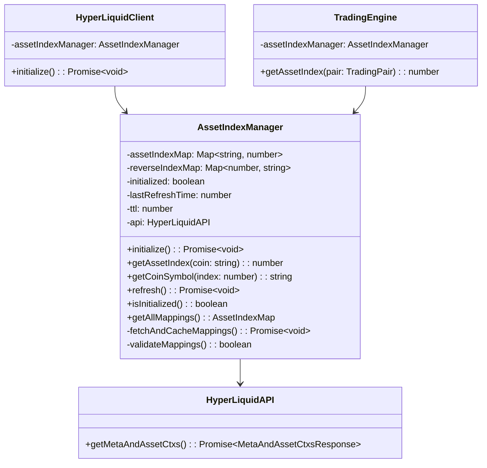
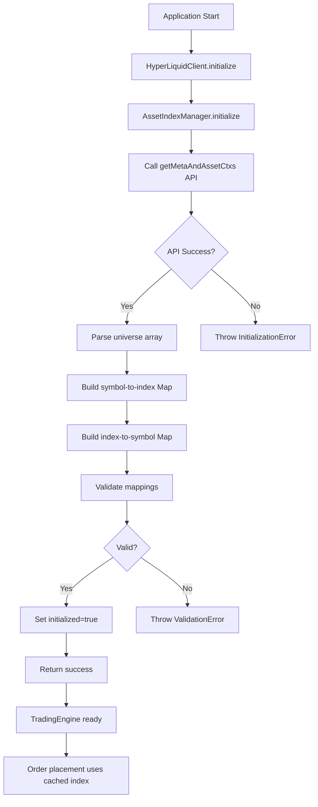

# Asset Index Mapping Module - Technical Specification

## 1. Overview

This specification defines a robust asset index mapping module for the HyperLiquid interface. The module provides a high-performance, cached mapping between coin symbols and their corresponding integer indices, eliminating redundant API calls and ensuring type-safe asset index resolution throughout the trading system.

## 2. Module Architecture

### 2.1 Class Structure



### 2.2 Data Flow



## 3. Type Definitions

### 3.1 API Response Types

Add to `src/types/hyperliquid.ts`:

```typescript
/**
 * Asset context information from HyperLiquid API
 */
export interface AssetContext {
    /**
     * Asset symbol (e.g., "BTC", "ETH", "SOL")
     */
    name: string;
    /**
     * Asset index (integer)
     */
    idx: number;
    /**
     * Maximum leverage for this asset
     */
    maxLeverage: number;
    /**
     * Whether the asset is only for trading (not funding)
     */
    onlyIsolated: boolean;
}

/**
 * Meta information from HyperLiquid API
 */
export interface MetaInfo {
    /**
     * Array of all available asset symbols
     */
    universe: string[];
}

/**
 * Complete response from metaAndAssetCtxs endpoint
 */
export interface MetaAndAssetCtxsResponse {
    /**
     * Meta information containing universe array
     */
    [0]: MetaInfo;
    /**
     * Array of asset contexts indexed by asset index
     */
    [1]: AssetContext[];
}
```

### 3.2 Module Types

Create new file `src/types/asset-index.ts`:

```typescript
/**
 * Mapping of coin symbol to asset index
 */
export type AssetIndexMap = Map<string, number>;

/**
 * Reverse mapping of asset index to coin symbol
 */
export type ReverseAssetIndexMap = Map<number, string>;

/**
 * Complete asset mapping state
 */
export interface AssetMappingState {
    /**
     * Symbol to index mapping
     */
    symbolToIndex: AssetIndexMap;
    /**
     * Index to symbol mapping
     */
    indexToSymbol: ReverseAssetIndexMap;
    /**
     * Timestamp of last refresh
     */
    lastRefreshTime: number;
    /**
     * Whether the mapping is initialized
     */
    initialized: boolean;
}

/**
 * Configuration for AssetIndexManager
 */
export interface AssetIndexConfig {
    /**
     * Time-to-live for cached mappings in milliseconds
     * Default: 1 hour (3600000ms)
     */
    ttl?: number;
    /**
     * Whether to automatically refresh on TTL expiration
     * Default: false
     */
    autoRefresh?: boolean;
    /**
     * Maximum number of retry attempts on initialization failure
     * Default: 3
     */
    maxRetries?: number;
    /**
     * Delay between retry attempts in milliseconds
     * Default: 1000ms
     */
    retryDelay?: number;
}

/**
 * Error types for asset index operations
 */
export class AssetIndexError extends Error {
    constructor(
        message: string,
        public code: AssetIndexErrorCode,
        public details?: unknown
    ) {
        super(message);
        this.name = 'AssetIndexError';
    }
}

export enum AssetIndexErrorCode {
    /**
     * Failed to initialize asset mappings
     */
    INITIALIZATION_FAILED = 'INITIALIZATION_FAILED',
    /**
     * Asset index not found for given symbol
     */
    ASSET_NOT_FOUND = 'ASSET_NOT_FOUND',
    /**
     * Mapping validation failed
     */
    VALIDATION_FAILED = 'VALIDATION_FAILED',
    /**
     * Manager not initialized
     */
    NOT_INITIALIZED = 'NOT_INITIALIZED',
    /**
     * API call failed
     */
    API_ERROR = 'API_ERROR',
    /**
     * Invalid configuration provided
     */
    INVALID_CONFIG = 'INVALID_CONFIG',
}
```

### 3.3 Module Interface

```typescript
/**
 * AssetIndexManager - Manages asset index mappings for HyperLiquid
 */
export interface IAssetIndexManager {
    /**
     * Initialize the manager by fetching asset mappings from API
     * @throws AssetIndexError if initialization fails
     */
    initialize(): Promise<void>;

    /**
     * Get the asset index for a given coin symbol
     * @param coin - Coin symbol (e.g., "BTC", "ETH")
     * @returns Asset index (integer)
     * @throws AssetIndexError if symbol not found or not initialized
     */
    getAssetIndex(coin: string): number;

    /**
     * Get the coin symbol for a given asset index
     * @param index - Asset index (integer)
     * @returns Coin symbol
     * @throws AssetIndexError if index not found or not initialized
     */
    getCoinSymbol(index: number): string;

    /**
     * Refresh the asset mappings from API
     * @throws AssetIndexError if refresh fails
     */
    refresh(): Promise<void>;

    /**
     * Check if the manager is initialized
     * @returns true if initialized, false otherwise
     */
    isInitialized(): boolean;

    /**
     * Get all current asset mappings
     * @returns Current mapping state
     */
    getAllMappings(): AssetMappingState;

    /**
     * Check if a coin symbol is valid
     * @param coin - Coin symbol to check
     * @returns true if valid, false otherwise
     */
    isValidCoin(coin: string): boolean;

    /**
     * Check if an asset index is valid
     * @param index - Asset index to check
     * @returns true if valid, false otherwise
     */
    isValidIndex(index: number): boolean;
}
```

## 4. API Design

### 4.1 Public Methods

| Method | Signature | Description | Throws |
|--------|-----------|-------------|--------|
| `initialize()` | `Promise<void>` | Fetch and cache asset mappings from API | `AssetIndexError` |
| `getAssetIndex()` | `(coin: string) => number` | Get index for coin symbol | `AssetIndexError` |
| `getCoinSymbol()` | `(index: number) => string` | Get symbol for asset index | `AssetIndexError` |
| `refresh()` | `Promise<void>` | Refresh cached mappings | `AssetIndexError` |
| `isInitialized()` | `() => boolean` | Check initialization status | - |
| `getAllMappings()` | `() => AssetMappingState` | Get all mappings | - |
| `isValidCoin()` | `(coin: string) => boolean` | Validate coin symbol | - |
| `isValidIndex()` | `(index: number) => boolean` | Validate asset index | - |

### 4.2 Method Details

#### `initialize()`
- **Purpose**: Fetch asset mappings from HyperLiquid API and cache them
- **Behavior**:
  1. Calls `getMetaAndAssetCtxs()` API endpoint
  2. Parses the `universe` array from response
  3. Creates bidirectional mappings (symbol↔index)
  4. Validates mappings
  5. Sets `initialized` flag to `true`
- **Retry Logic**: Retries up to `maxRetries` times with `retryDelay` between attempts
- **Throws**: `AssetIndexError` with `INITIALIZATION_FAILED` code if all retries fail

#### `getAssetIndex(coin: string)`
- **Purpose**: Retrieve asset index for a coin symbol
- **Behavior**:
  1. Checks if initialized, throws if not
  2. Looks up coin in `assetIndexMap`
  3. Returns index if found
- **Throws**: `AssetIndexError` with `NOT_INITIALIZED` or `ASSET_NOT_FOUND` code

#### `getCoinSymbol(index: number)`
- **Purpose**: Retrieve coin symbol for an asset index
- **Behavior**:
  1. Checks if initialized, throws if not
  2. Looks up index in `reverseIndexMap`
  3. Returns symbol if found
- **Throws**: `AssetIndexError` with `NOT_INITIALIZED` or `ASSET_NOT_FOUND` code

#### `refresh()`
- **Purpose**: Refresh cached mappings from API
- **Behavior**:
  1. Calls `fetchAndCacheMappings()` to update cache
  2. Updates `lastRefreshTime`
- **Throws**: `AssetIndexError` with `API_ERROR` code if refresh fails

## 5. Caching Strategy

### 5.1 Cache Structure

```typescript
class AssetIndexManager {
    // Primary cache: symbol -> index
    private assetIndexMap: Map<string, number>;

    // Reverse cache: index -> symbol
    private reverseIndexMap: Map<number, string>;

    // Metadata
    private initialized: boolean = false;
    private lastRefreshTime: number = 0;
    private ttl: number = 3600000; // 1 hour default
}
```

### 5.2 TTL Configuration

| Parameter | Type | Default | Description |
|-----------|------|---------|-------------|
| `ttl` | `number` | `3600000` (1 hour) | Time-to-live for cached mappings in milliseconds |
| `autoRefresh` | `boolean` | `false` | Whether to automatically refresh on TTL expiration |

### 5.3 Refresh Mechanism

1. **Manual Refresh**: Call `refresh()` method explicitly
2. **Auto Refresh** (optional): Check TTL before each `getAssetIndex()` call
3. **Initialization**: Always fetch fresh data on startup

### 5.4 Fallback Behavior

| Scenario | Behavior |
|----------|----------|
| API call fails during initialization | Retry up to `maxRetries` times, then throw error |
| Asset not found in cache | Throw `AssetIndexError` with `ASSET_NOT_FOUND` |
| Cache expired (TTL) | Continue using stale data if `autoRefresh=false`, otherwise refresh |
| Manager not initialized | Throw `AssetIndexError` with `NOT_INITIALIZED` |

## 6. Error Handling

### 6.1 Error Types

```typescript
export enum AssetIndexErrorCode {
    INITIALIZATION_FAILED = 'INITIALIZATION_FAILED',
    ASSET_NOT_FOUND = 'ASSET_NOT_FOUND',
    VALIDATION_FAILED = 'VALIDATION_FAILED',
    NOT_INITIALIZED = 'NOT_INITIALIZED',
    API_ERROR = 'API_ERROR',
    INVALID_CONFIG = 'INVALID_CONFIG',
}
```

### 6.2 Validation Logic

#### Mapping Validation
```typescript
private validateMappings(): boolean {
    // Check that both maps have the same size
    if (this.assetIndexMap.size !== this.reverseIndexMap.size) {
        return false;
    }

    // Check that all indices are non-negative integers
    for (const index of this.reverseIndexMap.keys()) {
        if (!Number.isInteger(index) || index < 0) {
            return false;
        }
    }

    // Check that all symbols are non-empty strings
    for (const symbol of this.assetIndexMap.keys()) {
        if (typeof symbol !== 'string' || symbol.length === 0) {
            return false;
        }
    }

    // Verify bidirectional consistency
    for (const [symbol, index] of this.assetIndexMap.entries()) {
        const reverseSymbol = this.reverseIndexMap.get(index);
        if (reverseSymbol !== symbol) {
            return false;
        }
    }

    return true;
}
```

### 6.3 Recovery Strategies

| Error Type | Recovery Strategy |
|------------|-------------------|
| `INITIALIZATION_FAILED` | Retry with exponential backoff, fail after max retries |
| `API_ERROR` | Log error, throw to caller for handling |
| `ASSET_NOT_FOUND` | Log warning, throw to caller (no recovery - invalid asset) |
| `VALIDATION_FAILED` | Log error, throw to caller (data corruption) |
| `NOT_INITIALIZED` | Throw to caller (programming error - call initialize first) |

## 7. Integration Points

### 7.1 Integration with HyperLiquidClient

**File**: `src/exchange/hyperliquid/client.ts`

**Changes**:
```typescript
import { AssetIndexManager } from './asset-index.js';

export class HyperLiquidClient extends EventEmitter {
    public api: HyperLiquidAPI;
    public ws: HyperLiquidWebSocket;
    public assetIndex: AssetIndexManager;  // New public property

    constructor(privateKey: string, isTestnet: boolean = false) {
        super();
        this.api = new HyperLiquidAPI(privateKey, isTestnet);
        this.ws = new HyperLiquidWebSocket(isTestnet);
        this.assetIndex = new AssetIndexManager(this.api);  // Initialize

        // Forward WS events
        this.ws.on('l2Book', (data) => this.emit('l2Book', data));
        this.ws.on('userFill', (data) => this.emit('userFill', data));
    }

    public async connect(): Promise<void> {
        try {
            // Initialize asset index mappings before connecting
            await this.assetIndex.initialize();
            await this.ws.connect();
            TradingLogger.info("HyperLiquid Client Connected");
        } catch (error) {
            TradingLogger.error("Failed to connect HyperLiquid Client");
            throw error;
        }
    }
}
```

### 7.2 Integration with TradingEngine

**File**: `src/core/engine.ts`

**Changes**:
```typescript
import { AssetIndexManager } from '../exchange/hyperliquid/asset-index.js';

export class TradingEngine {
    private client: HyperLiquidClient;
    private signalProcessor: SignalProcessor;
    private riskManager: RiskManager;
    private positions: Map<TradingPair, Position> = new Map();
    private assetIndex: AssetIndexManager;  // New property

    constructor(
        client: HyperLiquidClient,
        signalProcessor: SignalProcessor,
        riskManager: RiskManager
    ) {
        this.client = client;
        this.signalProcessor = signalProcessor;
        this.riskManager = riskManager;
        this.assetIndex = client.assetIndex;  // Reference client's manager
    }

    /**
     * Map trading pair to HyperLiquid asset index
     * Now uses the AssetIndexManager instead of hardcoded mapping
     */
    private getAssetIndex(pair: TradingPair): number {
        const coin = pair.split('-')[0];  // Extract coin symbol (e.g., "BTC" from "BTC-USDC")
        return this.assetIndex.getAssetIndex(coin);
    }
}
```

### 7.3 Integration with Main Initialization

**File**: `src/index.ts`

**Changes**:
```typescript
// No direct changes needed - initialization happens in HyperLiquidClient.connect()
// The asset index manager is initialized automatically when client.connect() is called

public async start(): Promise<void> {
    try {
        TradingLogger.info("Starting Trading Bot...");
        this.isRunning = true;

        // Start WebSocket connections (this initializes asset index mappings)
        await this.client.connect();

        // Asset index mappings are now available via this.client.assetIndex
        TradingLogger.info(`Asset mappings loaded: ${this.client.assetIndex.getAllMappings().symbolToIndex.size} assets`);

        // ... rest of initialization
    } catch (error) {
        TradingLogger.logError(error as Error, "Failed to start bot");
        throw error;
    }
}
```

### 7.4 Integration with API Types

**File**: `src/exchange/hyperliquid/api.ts`

**Changes**:
```typescript
import { MetaAndAssetCtxsResponse } from '../../types/hyperliquid.js';

export class HyperLiquidAPI {
    // ... existing code ...

    /**
     * Get meta information and asset contexts
     * @returns Promise resolving to meta and asset context data
     */
    public async getMetaAndAssetCtxs(): Promise<MetaAndAssetCtxsResponse> {
        return this.postInfo({ type: 'metaAndAssetCtxs' });
    }

    // ... rest of code ...
}
```

## 8. File Structure

### 8.1 New Files

| Path | Purpose |
|------|---------|
| `src/exchange/hyperliquid/asset-index.ts` | Main AssetIndexManager implementation |
| `src/types/asset-index.ts` | Type definitions for asset index module |

### 8.2 Modified Files

| Path | Changes |
|------|---------|
| `src/exchange/hyperliquid/api.ts` | Update `getMetaAndAssetCtxs()` return type |
| `src/exchange/hyperliquid/client.ts` | Add `assetIndex` property and initialize in `connect()` |
| `src/core/engine.ts` | Replace hardcoded `getAssetIndex()` with AssetIndexManager usage |
| `src/types/hyperliquid.ts` | Add `MetaAndAssetCtxsResponse`, `AssetContext`, `MetaInfo` types |
| `src/exchange/hyperliquid/index.ts` | Export `AssetIndexManager` |

### 8.3 Directory Structure

```
src/
├── exchange/
│   └── hyperliquid/
│       ├── api.ts              (modified)
│       ├── asset-index.ts      (new)
│       ├── client.ts           (modified)
│       ├── index.ts            (modified)
│       ├── signing.ts
│       └── websocket.ts
├── core/
│   └── engine.ts               (modified)
├── types/
│   ├── asset-index.ts          (new)
│   ├── hyperliquid.ts          (modified)
│   └── index.ts
└── index.ts                    (modified)
```

## 9. Implementation Notes

### 9.1 Performance Considerations

1. **O(1) Lookup**: Map provides constant-time lookups for both directions
2. **Single API Call**: Only one API call needed during initialization
3. **Memory Efficient**: Two Maps storing the same data in different orientations
4. **No Redundant Calls**: Cached data persists for application lifetime

### 9.2 Thread Safety

- TypeScript/JavaScript is single-threaded, so no locking needed
- All operations are atomic at the language level

### 9.3 Testing Recommendations

1. **Unit Tests**:
   - Test initialization success/failure
   - Test `getAssetIndex()` with valid/invalid symbols
   - Test `getCoinSymbol()` with valid/invalid indices
   - Test validation logic
   - Test retry behavior

2. **Integration Tests**:
   - Test with actual HyperLiquid API
   - Test integration with `HyperLiquidClient`
   - Test integration with `TradingEngine`

### 9.4 Logging

Use `TradingLogger` for all logging:
- `info`: Initialization success, refresh operations
- `warn`: Asset not found, using stale cache
- `error`: Initialization failures, API errors, validation failures

## 10. Migration Path

### 10.1 Backward Compatibility

The module is designed to be backward compatible:
- Existing `getAssetIndex()` method in `TradingEngine` will work with new implementation
- No changes required to strategy code
- No changes required to risk management code

### 10.2 Rollout Steps

1. Create new type definitions in `src/types/asset-index.ts`
2. Update `src/types/hyperliquid.ts` with API response types
3. Implement `AssetIndexManager` in `src/exchange/hyperliquid/asset-index.ts`
4. Update `src/exchange/hyperliquid/api.ts` return type
5. Update `src/exchange/hyperliquid/client.ts` to use `AssetIndexManager`
6. Update `src/core/engine.ts` to use `AssetIndexManager`
7. Update `src/exchange/hyperliquid/index.ts` to export new module
8. Test thoroughly

## 11. Future Enhancements

### 11.1 Potential Improvements

1. **Periodic Auto-Refresh**: Add background refresh on TTL expiration
2. **Persistence**: Cache mappings to disk for faster startup
3. **Change Detection**: Detect and log when asset universe changes
4. **Metrics**: Add metrics for cache hit rate, refresh frequency
5. **Event Emission**: Emit events when mappings are refreshed

### 11.2 Extension Points

```typescript
// Potential future interface
interface IAssetIndexManagerExtended extends IAssetIndexManager {
    onMappingChange(callback: (mappings: AssetMappingState) => void): void;
    getCacheAge(): number;
    forceRefresh(): Promise<void>;
    exportMappings(): string;  // JSON export
    importMappings(json: string): void;
}
```

## 12. Summary

This specification provides a complete design for a robust asset index mapping module that:

- ✅ Initializes during application startup
- ✅ Provides high-performance O(1) lookups
- ✅ Is globally accessible via `HyperLiquidClient.assetIndex`
- ✅ Includes comprehensive error handling
- ✅ Provides full TypeScript type safety
- ✅ Integrates seamlessly with existing code
- ✅ Supports future enhancements

The module eliminates the hardcoded mapping in `TradingEngine` and provides a maintainable, scalable solution for asset index resolution.
