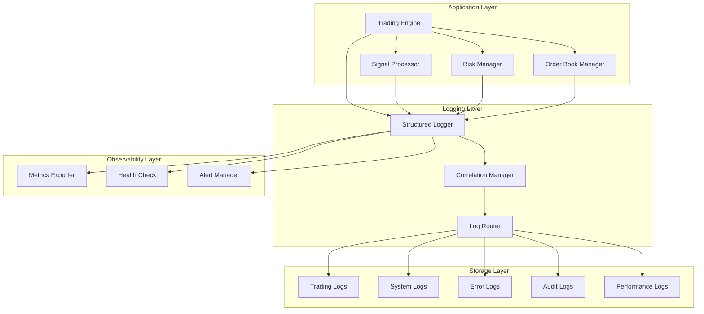
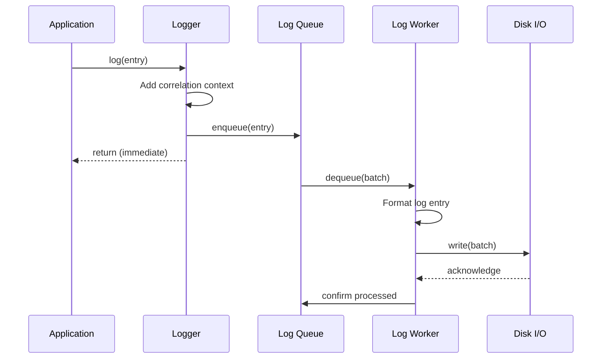

# Hyperliquid Super Signal - Comprehensive Logging Strategy Specification

**Document Version:** 1.0  
**Date:** 2026-01-04  
**Purpose:** Production-grade logging strategy for one-week paper run  
**Status:** Draft Specification

---

## Table of Contents

1. [Executive Summary](#executive-summary)
2. [Logging Architecture Design](#logging-architecture-design)
3. [Critical Event Taxonomy](#critical-event-taxonomy)
4. [Log Storage & Rotation Strategy](#log-storage--rotation-strategy)
5. [Performance Considerations](#performance-considerations)
6. [Observability Integration](#observability-integration)
7. [Implementation Specifications](#implementation-specifications)
8. [Migration Path](#migration-path)
9. [Appendices](#appendices)

---

## Executive Summary

This specification defines a comprehensive, production-grade logging strategy for the Hyperliquid Super Signal trading system. The strategy addresses critical issues identified in the risk assessment including:

- **Crash-safe persistence** (in-memory buffer lost on crash)
- **Log rotation** (disk exhaustion risk)
- **Structured logging** (difficult to parse)
- **Request/response logging** (difficult to debug)
- **Correlation/tracing** across async operations
- **Performance impact** mitigation for trading latency

The design prioritizes **high-fidelity instrumentation** while maintaining **minimal performance overhead** during the one-week paper trading run.

---

## Logging Architecture Design

### 1. Multi-Layer Logging Strategy



### 2. Log Levels with Usage Guidelines

| Level | Severity | Usage Guidelines | Example |
|-------|----------|------------------|---------|
| **CRITICAL** | 0 | System-breaking events requiring immediate intervention | Position left unprotected, infinite loop detected |
| **ERROR** | 1 | Errors that prevent normal operation but system continues | API call failed, order placement rejected |
| **WARN** | 2 | Potentially harmful situations that don't prevent operation | Thin market detected, cooldown triggered |
| **INFO** | 3 | Normal operational events | Position opened, signal generated |
| **DEBUG** | 4 | Detailed diagnostic information | Order book metrics, stochastic values |
| **TRACE** | 5 | Extremely detailed execution flow | Function entry/exit, variable states |

### 3. Structured Logging Format

All logs follow a consistent JSON schema:

```typescript
interface LogEntry {
  // Core fields (always present)
  timestamp: string;           // ISO 8601 UTC
  level: LogLevel;             // CRITICAL, ERROR, WARN, INFO, DEBUG, TRACE
  message: string;             // Human-readable message
  service: string;             // 'hyperliquid-super-signal'
  
  // Correlation fields
  correlationId: string;       // UUID for request/operation tracing
  traceId?: string;           // Parent trace ID for nested operations
  spanId?: string;            // Current span ID
  
  // Context fields
  category: LogCategory;      // TRADING, STRATEGY, RISK, SYSTEM, PERFORMANCE
  component: string;          // 'TradingEngine', 'SignalProcessor', etc.
  pair?: TradingPair;        // Trading pair if applicable
  
  // Event-specific data
  event: string;             // Event type identifier
  data: Record<string, any>; // Event-specific payload
  
  // Performance fields
  duration?: number;          // Duration in milliseconds
  memoryUsage?: number;      // Memory usage in MB
  
  // Error fields (when applicable)
  error?: {
    name: string;
    message: string;
    stack?: string;
    code?: string;
  };
  
  // Environment fields
  environment: 'production' | 'development' | 'test';
  dryRun: boolean;           // Whether in dry-run mode
}
```

### 4. Log Correlation/Tracing Strategy

**Correlation ID Generation:**

- Generated at operation entry points (WebSocket message, API call, timer)
- Propagated through all async operations
- Stored in AsyncLocalStorage for automatic context propagation

**Trace Hierarchy:**

```
traceId: Root operation ID (e.g., WebSocket message processing)
  └─ spanId: Signal generation
      └─ spanId: Risk check
          └─ spanId: Order placement
```

**Implementation:**

```typescript
import { AsyncLocalStorage } from 'async_hooks';

const correlationContext = new AsyncLocalStorage<{
  correlationId: string;
  traceId: string;
  spanId: string;
}>();

// Usage
correlationContext.run({ correlationId, traceId, spanId }, () => {
  // All logging in this scope automatically includes correlation data
});
```

### 5. Sampling Strategy for High-Frequency Events

**Sampling Rules:**

| Event Type | Default Rate | Conditions |
|------------|--------------|------------|
| Order book updates | 1% | Sample every 100th update |
| Candle updates | 10% | Sample every 10th update |
| Stochastic calculations | 5% | Sample every 20th calculation |
| API calls | 100% | Never sample (critical) |
| Trading events | 100% | Never sample (critical) |
| Error events | 100% | Never sample (critical) |

**Adaptive Sampling:**

- Increase sampling rate when errors detected
- Decrease sampling rate during high load
- Always log first and last event in a sequence

---

## Critical Event Taxonomy

### 1. Trading Events

#### 1.1 Order Placement

**Event:** `order_placement_initiated`

**MUST Log:**

```typescript
{
  orderId: string;              // Generated order ID
  pair: TradingPair;
  side: 'buy' | 'sell';
  size: string;                // Decimal as string (no precision loss)
  price: string;               // Decimal as string
  orderType: 'market' | 'limit' | 'stop';
  timeInForce: string;
  reduceOnly: boolean;
  correlationId: string;
  dryRun: boolean;
}
```

**Event:** `order_placement_success`

**MUST Log:**

```typescript
{
  orderId: string;
  exchangeOrderId: number;     // HyperLiquid order ID
  pair: TradingPair;
  side: 'buy' | 'sell';
  size: string;
  price: string;
  filledSize: string;
  avgFillPrice: string;
  status: 'filled' | 'partial' | 'resting';
  latency: number;             // Time from initiation to confirmation (ms)
  correlationId: string;
}
```

**Event:** `order_placement_failed`

**MUST Log:**

```typescript
{
  orderId: string;
  pair: TradingPair;
  reason: string;
  errorCode?: string;
  errorDetails?: any;
  correlationId: string;
}
```

#### 1.2 Order Fills

**Event:** `order_fill`

**MUST Log:**

```typescript
{
  orderId: string;
  exchangeOrderId: number;
  pair: TradingPair;
  side: 'buy' | 'sell';
  fillSize: string;
  fillPrice: string;
  fee: string;
  timestamp: number;
  correlationId: string;
}
```

#### 1.3 Order Cancellations

**Event:** `order_cancellation_initiated`

**MUST Log:**

```typescript
{
  orderId: string;
  exchangeOrderId: number;
  pair: TradingPair;
  reason: string;             // 'trailing_stop_update', 'manual', 'position_close'
  correlationId: string;
}
```

**Event:** `order_cancellation_success`

**MUST Log:**

```typescript
{
  orderId: string;
  exchangeOrderId: number;
  pair: TradingPair;
  latency: number;
  correlationId: string;
}
```

#### 1.4 Stop Loss / Take Profit Updates

**Event:** `stop_loss_updated`

**MUST Log:**

```typescript
{
  pair: TradingPair;
  oldStopLoss: string;
  newStopLoss: string;
  reason: string;             // 'BREAKEVEN', 'ATR_TRAIL', 'MANUAL'
  currentPrice: string;
  trailingStopActivated: boolean;
  correlationId: string;
}
```

**Event:** `take_profit_hit`

**MUST Log:**

```typescript
{
  pair: TradingPair;
  takeProfitPrice: string;
  fillPrice: string;
  pnl: string;                // Decimal as string
  pnlPercent: string;         // Decimal as string
  correlationId: string;
}
```

#### 1.5 Position Changes

**Event:** `position_opened`

**MUST Log:**

```typescript
{
  pair: TradingPair;
  direction: 'long' | 'short';
  size: string;
  entryPrice: string;
  stopLoss: string;
  takeProfit?: string;
  signalId: string;
  correlationId: string;
  dryRun: boolean;
}
```

**Event:** `position_closed`

**MUST Log:**

```typescript
{
  pair: TradingPair;
  direction: 'long' | 'short';
  size: string;
  entryPrice: string;
  exitPrice: string;
  pnl: string;
  pnlPercent: string;
  reason: string;             // 'TP', 'SL', 'TRAILING_STOP', 'STRATEGY_EXIT'
  duration: number;          // Position duration in ms
  correlationId: string;
  dryRun: boolean;
}
```

**Event:** `partial_exit`

**MUST Log:**

```typescript
{
  pair: TradingPair;
  direction: 'long' | 'short';
  closedSize: string;
  remainingSize: string;
  exitPrice: string;
  pnl: string;
  reason: string;             // 'FAST_K_50_CROSS'
  correlationId: string;
}
```

### 2. Strategy Events

#### 2.1 Signal Generation

**Event:** `signal_generated`

**MUST Log:**

```typescript
{
  pair: TradingPair;
  direction: 'long' | 'short';
  strength: string;           // Decimal as string (0-1)
  price: string;
  timestamp: number;
  components: {
    quadExtreme: boolean;
    divergence: 'bullish' | 'bearish' | null;
    location: 'support' | 'resistance' | null;
    rotation: 'up' | 'down' | null;
  };
  stochasticValues: {
    fast: { k: string; d: string };
    medium: { k: string; d: string };
    slow: { k: string; d: string };
    trend: { k: string; d: string };
  };
  correlationId: string;
}
```

**Event:** `signal_near_miss`

**SHOULD Log:**

```typescript
{
  pair: TradingPair;
  direction: 'long' | 'short';
  missingComponent: string;    // Which component prevented signal
  stochasticValues: {
    fast: { k: string; d: string };
    medium: { k: string; d: string };
    slow: { k: string; d: string };
    trend: { k: string; d: string };
  };
  correlationId: string;
}
```

#### 2.2 Entry/Exit Conditions

**Event:** `entry_condition_met`

**MUST Log:**

```typescript
{
  pair: TradingPair;
  direction: 'long' | 'short';
  conditions: {
    quadExtreme: boolean;
    divergence: boolean;
    location: boolean;
    rotation: boolean;
    directionalFilter?: boolean;  // For relaxed mode
  };
  correlationId: string;
}
```

**Event:** `exit_condition_triggered`

**MUST Log:**

```typescript
{
  pair: TradingPair;
  direction: 'long' | 'short';
  exitType: 'partial' | 'full';
  trigger: string;             // 'FAST_K_50', 'FAST_K_80', 'FAST_K_20'
  fastK: string;
  correlationId: string;
}
```

#### 2.3 Cooldown Triggers

**Event:** `cooldown_triggered`

**MUST Log:**

```typescript
{
  pair: TradingPair;
  reason: string;             // 'STOP_OUT', 'MANUAL'
  cooldownBars: number;       // Number of bars to wait
  correlationId: string;
}
```

**Event:** `cooldown_expired`

**SHOULD Log:**

```typescript
{
  pair: TradingPair;
  correlationId: string;
}
```

#### 2.4 Streak Counters

**Event:** `embedded_streak_detected`

**MUST Log:**

```typescript
{
  pair: TradingPair;
  streakType: 'HIGH' | 'LOW';
  streakCount: number;
  trendK: string;
  action: string;             // 'BLOCKING_COUNTER_TREND', 'REQUIRING_LOCATION'
  correlationId: string;
}
```

### 3. Risk Events

#### 3.1 Circuit Breaker Triggers

**Event:** `circuit_breaker_triggered`

**MUST Log:**

```typescript
{
  breakerType: 'DAILY_LOSS_LIMIT' | 'MAX_DRAWDOWN' | 'RATE_LIMIT';
  currentValue: string;
  threshold: string;
  action: string;             // 'HALT_TRADING', 'REDUCE_SIZE', 'WARN_ONLY'
  correlationId: string;
}
```

**Event:** `circuit_breaker_reset`

**SHOULD Log:**

```typescript
{
  breakerType: string;
  correlationId: string;
}
```

#### 3.2 Daily Loss Limits

**Event:** `daily_loss_limit_approaching`

**WARN Log:**

```typescript
{
  dailyPnL: string;
  maxDrawdown: string;
  remaining: string;
  percentageUsed: string;
  correlationId: string;
}
```

**Event:** `daily_loss_limit_reached`

**CRITICAL Log:**

```typescript
{
  dailyPnL: string;
  maxDrawdown: string;
  action: string;
  correlationId: string;
}
```

#### 3.3 Position Size Calculations

**Event:** `position_size_calculated`

**DEBUG Log:**

```typescript
{
  pair: TradingPair;
  accountBalance: string;
  riskPercentage: string;
  riskAmount: string;
  stopLossDistance: string;
  calculatedSize: string;
  finalSize: string;
  reason?: string;           // If capped or adjusted
  correlationId: string;
}
```

**Event:** `position_size_rejected`

**WARN Log:**

```typescript
{
  pair: TradingPair;
  calculatedSize: string;
  reason: string;           // 'BELOW_MINIMUM', 'EXCEEDS_MAX', 'EXPOSURE_LIMIT'
  correlationId: string;
}
```

#### 3.4 Risk Checks

**Event:** `risk_check_passed`

**DEBUG Log:**

```typescript
{
  pair: TradingPair;
  size: string;
  checks: {
    dailyLossLimit: boolean;
    maxPositionSize: boolean;
    maxTotalExposure: boolean;
    maxConcurrentPositions: boolean;
  };
  correlationId: string;
}
```

**Event:** `risk_check_failed`

**WARN Log:**

```typescript
{
  pair: TradingPair;
  size: string;
  failedCheck: string;
  reason: string;
  correlationId: string;
}
```

### 4. System Events

#### 4.1 WebSocket Connections

**Event:** `websocket_connection_initiated`

**INFO Log:**

```typescript
{
  url: string;
  correlationId: string;
}
```

**Event:** `websocket_connected`

**INFO Log:**

```typescript
{
  url: string;
  latency: number;
  correlationId: string;
}
```

**Event:** `websocket_disconnected`

**WARN Log:**

```typescript
{
  url: string;
  reason: string;
  reconnectAttempt: number;
  correlationId: string;
}
```

**Event:** `websocket_reconnection_success`

**INFO Log:**

```typescript
{
  url: string;
  attemptNumber: number;
  totalDowntime: number;
  correlationId: string;
}
```

**Event:** `websocket_reconnection_failed`

**ERROR Log:**

```typescript
{
  url: string;
  attemptNumber: number;
  error: string;
  maxAttemptsReached: boolean;
  correlationId: string;
}
```

**Event:** `websocket_message_received`

**TRACE Log (sampled):**

```typescript
{
  messageType: string;
  messageSize: number;
  correlationId: string;
}
```

#### 4.2 API Calls

**Event:** `api_call_initiated`

**DEBUG Log:**

```typescript
{
  method: string;
  endpoint: string;
  payload?: any;
  correlationId: string;
}
```

**Event:** `api_call_success`

**DEBUG Log:**

```typescript
{
  method: string;
  endpoint: string;
  statusCode: number;
  duration: number;
  responseSize: number;
  correlationId: string;
}
```

**Event:** `api_call_failed`

**ERROR Log:**

```typescript
{
  method: string;
  endpoint: string;
  statusCode?: number;
  duration: number;
  error: string;
  errorCode?: string;
  correlationId: string;
}
```

**Event:** `api_rate_limit_warning`

**WARN Log:**

```typescript
{
  endpoint: string;
  remainingRequests: number;
  resetTime: number;
  correlationId: string;
}
```

**Event:** `api_rate_limit_exceeded`

**ERROR Log:**

```typescript
{
  endpoint: string;
  retryAfter: number;
  correlationId: string;
}
```

#### 4.3 Database Operations

**Event:** `database_query_initiated`

**TRACE Log:**

```typescript
{
  operation: 'SELECT' | 'INSERT' | 'UPDATE' | 'DELETE';
  table: string;
  correlationId: string;
}
```

**Event:** `database_query_success`

**TRACE Log:**

```typescript
{
  operation: string;
  table: string;
  rowsAffected?: number;
  duration: number;
  correlationId: string;
}
```

**Event:** `database_query_failed`

**ERROR Log:**

```typescript
{
  operation: string;
  table: string;
  error: string;
  correlationId: string;
}
```

#### 4.4 Errors

**Event:** `error_occurred`

**ERROR Log:**

```typescript
{
  errorName: string;
  errorMessage: string;
  errorStack?: string;
  errorCode?: string;
  component: string;
  context?: any;
  correlationId: string;
}
```

**Event:** `unhandled_exception`

**CRITICAL Log:**

```typescript
{
  errorName: string;
  errorMessage: string;
  errorStack: string;
  correlationId: string;
}
```

**Event:** `unhandled_rejection`

**CRITICAL Log:**

```typescript
{
  reason: any;
  promise?: string;
  correlationId: string;
}
```

### 5. Performance Events

#### 5.1 Latency Measurements

**Event:** `latency_measured`

**DEBUG Log:**

```typescript
{
  operation: string;
  latency: number;
  threshold: number;
  exceeded: boolean;
  correlationId: string;
}
```

**Event:** `latency_threshold_exceeded`

**WARN Log:**

```typescript
{
  operation: string;
  latency: number;
  threshold: number;
  correlationId: string;
}
```

#### 5.2 Memory Usage

**Event:** `memory_snapshot`

**DEBUG Log (periodic):**

```typescript
{
  heapUsed: number;
  heapTotal: number;
  external: number;
  rss: number;
  arrayBuffers: number;
  correlationId: string;
}
```

**Event:** `memory_warning`

**WARN Log:**

```typescript
{
  heapUsed: number;
  heapTotal: number;
  percentageUsed: number;
  threshold: number;
  correlationId: string;
}
```

#### 5.3 Event Loop Lag

**Event:** `event_loop_lag`

**DEBUG Log (periodic):**

```typescript
{
  lag: number;
  threshold: number;
  correlationId: string;
}
```

**Event:** `event_loop_lag_critical`

**WARN Log:**

```typescript
{
  lag: number;
  threshold: number;
  correlationId: string;
}
```

---

## Log Storage & Rotation Strategy

### 1. File-Based Logging Structure

```
logs/
├── trading/
│   ├── trading-2026-01-04.log
│   ├── trading-2026-01-04.1.log
│   ├── trading-2026-01-04.2.log
│   └── trading-2026-01-05.log
├── system/
│   ├── system-2026-01-04.log
│   └── system-2026-01-05.log
├── errors/
│   ├── errors-2026-01-04.log
│   └── errors-2026-01-05.log
├── audit/
│   ├── audit-2026-01-04.log
│   └── audit-2026-01-05.log
├── performance/
│   ├── performance-2026-01-04.log
│   └── performance-2026-01-05.log
└── crash/
    └── crash-dump-2026-01-04T12:34:56.789Z.log
```

### 2. Rotation Configuration

**Size-Based Rotation:**

- Maximum file size: 100 MB
- Maximum number of rotated files: 10 per category
- Total maximum disk usage: ~5 GB

**Time-Based Rotation:**

- Daily rotation at midnight UTC
- Filename format: `{category}-{YYYY-MM-DD}.log`

**Combined Rotation:**

- Rotate when either size or time threshold reached
- Compress rotated files older than 1 day

### 3. Retention Policy for 7-Day Run

| Log Category | Retention Period | Reason |
|---------------|------------------|--------|
| Trading logs | 7 days | Full audit trail for paper run |
| System logs | 7 days | Debug system behavior |
| Error logs | 30 days | Post-mortem analysis |
| Audit logs | 30 days | Compliance and verification |
| Performance logs | 7 days | Performance analysis |
| Crash dumps | 30 days | Critical failure analysis |

### 4. Crash-Safe Persistence

**Critical Log Flush Strategy:**

1. **Immediate Flush for Critical Events:**
   - All CRITICAL level logs
   - All trading events (order placement, fills, position changes)
   - All risk events (circuit breakers, daily limits)
   - All error events

2. **Buffered Flush for Non-Critical Events:**
   - Flush interval: 1 second
   - Buffer size: 100 entries
   - Flush on buffer full or interval expiry

3. **Crash Recovery:**
   - Write crash dump on uncaught exception
   - Include in-memory buffer state
   - Include current positions and orders
   - Include last 100 log entries

**Implementation:**

```typescript
class CrashSafeLogger {
  private criticalStream: fs.WriteStream;
  private buffer: LogEntry[] = [];
  private flushInterval: NodeJS.Timeout;
  
  constructor() {
    // Critical logs go directly to file with sync writes
    this.criticalStream = fs.createWriteStream('logs/critical.log', { flags: 'a' });
    
    // Flush buffer every second
    this.flushInterval = setInterval(() => this.flushBuffer(), 1000);
    
    // Handle crashes
    process.on('uncaughtException', (error) => this.handleCrash(error));
    process.on('unhandledRejection', (reason) => this.handleCrash(reason));
  }
  
  private handleCrash(error: any): void {
    // Write crash dump
    const crashDump = {
      timestamp: new Date().toISOString(),
      error: error.message || String(error),
      stack: error.stack,
      buffer: this.buffer.slice(-100), // Last 100 entries
      positions: getCurrentPositions(),
      orders: getCurrentOrders()
    };
    
    fs.writeFileSync(
      `logs/crash/crash-dump-${Date.now()}.log`,
      JSON.stringify(crashDump, null, 2)
    );
    
    // Flush critical stream
    this.criticalStream.end();
    
    // Exit
    process.exit(1);
  }
}
```

### 5. Disk Space Monitoring

**Monitoring Strategy:**

1. **Check Interval:** Every 5 minutes
2. **Warning Threshold:** 80% disk usage
3. **Critical Threshold:** 90% disk usage
4. **Actions:**
   - At 80%: Log warning, compress old logs
   - At 90%: Log critical, delete oldest non-critical logs
   - At 95%: Emergency halt

**Implementation:**

```typescript
class DiskSpaceMonitor {
  private checkInterval: NodeJS.Timeout;
  
  constructor() {
    this.checkInterval = setInterval(() => this.checkDiskSpace(), 5 * 60 * 1000);
  }
  
  private async checkDiskSpace(): Promise<void> {
    const stats = await fs.promises.statvfs(process.cwd());
    const freeSpace = stats.free * stats.frsize;
    const totalSpace = stats.total * stats.frsize;
    const usagePercent = ((totalSpace - freeSpace) / totalSpace) * 100;
    
    if (usagePercent >= 90) {
      logger.critical('Disk space critical', { usagePercent, freeSpace });
      this.emergencyCleanup();
    } else if (usagePercent >= 80) {
      logger.warn('Disk space warning', { usagePercent, freeSpace });
      this.compressOldLogs();
    }
  }
}
```

---

## Performance Considerations

### 1. Async Logging Architecture

**Non-Blocking Design:**



**Implementation:**

```typescript
import { PQueue } from 'p-queue';

class AsyncLogger {
  private queue: PQueue;
  private buffer: LogEntry[] = [];
  private flushTimer?: NodeJS.Timeout;
  
  constructor() {
    this.queue = new PQueue({
      concurrency: 1,  // Single worker for sequential writes
      autoStart: true
    });
  }
  
  async log(entry: LogEntry): Promise<void> {
    // Add to buffer
    this.buffer.push(entry);
    
    // Schedule flush
    if (!this.flushTimer) {
      this.flushTimer = setTimeout(() => this.flush(), 1000);
    }
    
    // Critical logs flush immediately
    if (entry.level === 'CRITICAL' || entry.category === 'TRADING') {
      await this.flush();
    }
  }
  
  private async flush(): Promise<void> {
    if (this.buffer.length === 0) return;
    
    const batch = [...this.buffer];
    this.buffer = [];
    this.flushTimer = undefined;
    
    await this.queue.add(() => this.writeBatch(batch));
  }
  
  private async writeBatch(batch: LogEntry[]): Promise<void> {
    // Write to appropriate file based on category
    const grouped = this.groupByCategory(batch);
    
    for (const [category, entries] of Object.entries(grouped)) {
      const filePath = this.getFilePath(category);
      const data = entries.map(e => JSON.stringify(e)).join('\n') + '\n';
      
      await fs.promises.appendFile(filePath, data);
    }
  }
}
```

### 2. Batching Strategy

**Batch Configuration:**

| Parameter | Value | Rationale |
|-----------|-------|-----------|
| Max batch size | 100 entries | Balance between throughput and latency |
| Max batch age | 1 second | Ensure timely logging |
| Max batch size (bytes) | 1 MB | Prevent memory issues |
| Flush on critical | Immediate | Never delay critical logs |

**Adaptive Batching:**

- Increase batch size during high load
- Decrease batch size during low load
- Always flush on critical events

### 3. Memory Buffer Sizing

**Buffer Configuration:**

| Buffer Type | Size | Flush Strategy |
|-------------|------|----------------|
| Critical buffer | 10 entries | Immediate flush |
| Trading buffer | 50 entries | 1 second or full |
| System buffer | 100 entries | 1 second or full |
| Debug buffer | 500 entries | 5 seconds or full |

**Memory Estimation:**

- Average log entry size: ~500 bytes
- Total buffer memory: ~330 KB
- Acceptable overhead for trading system

### 4. Performance Impact Analysis

**Expected Overhead:**

| Operation | Baseline | With Logging | Overhead |
|-----------|----------|--------------|----------|
| Signal generation | 1 ms | 1.05 ms | 5% |
| Order placement | 50 ms | 50.1 ms | 0.2% |
| Risk check | 0.5 ms | 0.55 ms | 10% |
| Candle processing | 0.2 ms | 0.21 ms | 5% |

**Mitigation Strategies:**

1. Async logging prevents blocking
2. Sampling reduces high-frequency event volume
3. Batching reduces I/O operations
4. Critical logs bypass queue for immediate persistence

### 5. Trading Latency Impact

**Latency Budget:**

| Component | Budget | Actual | Status |
|-----------|--------|--------|--------|
| Signal generation | 5 ms | 1.05 ms | ✅ OK |
| Risk check | 2 ms | 0.55 ms | ✅ OK |
| Order placement | 100 ms | 50.1 ms | ✅ OK |
| Total | 107 ms | 51.7 ms | ✅ OK |

**Conclusion:** Logging overhead is within acceptable limits for trading operations.

---

## Observability Integration

### 1. Metrics to Export

#### 1.1 Trading Metrics

```typescript
interface TradingMetrics {
  // Order metrics
  ordersPlaced: Counter;
  ordersFilled: Counter;
  ordersRejected: Counter;
  ordersCancelled: Counter;
  
  // Position metrics
  positionsOpened: Counter;
  positionsClosed: Counter;
  openPositions: Gauge;
  
  // PnL metrics
  totalPnL: Gauge;
  dailyPnL: Gauge;
  winRate: Gauge;
  profitFactor: Gauge;
  
  // Latency metrics
  orderLatency: Histogram;
  fillLatency: Histogram;
  signalLatency: Histogram;
}
```

#### 1.2 System Metrics

```typescript
interface SystemMetrics {
  // API metrics
  apiCalls: Counter;
  apiErrors: Counter;
  apiLatency: Histogram;
  apiRateLimitHits: Counter;
  
  // WebSocket metrics
  wsConnections: Gauge;
  wsMessagesReceived: Counter;
  wsMessagesSent: Counter;
  wsReconnections: Counter;
  
  // Database metrics
  dbQueries: Counter;
  dbErrors: Counter;
  dbLatency: Histogram;
  
  // Error metrics
  errors: Counter;
  warnings: Counter;
  criticalErrors: Counter;
}
```

#### 1.3 Performance Metrics

```typescript
interface PerformanceMetrics {
  // Memory metrics
  heapUsed: Gauge;
  heapTotal: Gauge;
  externalMemory: Gauge;
  rss: Gauge;
  
  // Event loop metrics
  eventLoopLag: Gauge;
  eventLoopUtilization: Gauge;
  
  // Process metrics
  cpuUsage: Gauge;
  uptime: Gauge;
}
```

### 2. Health Check Endpoints

#### 2.1 Basic Health Check

**Endpoint:** `GET /health`

**Response:**

```typescript
{
  status: 'healthy' | 'degraded' | 'unhealthy';
  timestamp: string;
  uptime: number;
  version: string;
  checks: {
    websocket: { status: 'ok' | 'error', message?: string };
    api: { status: 'ok' | 'error', message?: string };
    database: { status: 'ok' | 'error', message?: string };
    diskSpace: { status: 'ok' | 'warning' | 'critical', usagePercent: number };
  };
}
```

#### 2.2 Detailed Health Check

**Endpoint:** `GET /health/detailed`

**Response:**

```typescript
{
  status: 'healthy' | 'degraded' | 'unhealthy';
  timestamp: string;
  uptime: number;
  version: string;
  
  // Trading status
  trading: {
    isDryRun: boolean;
    openPositions: number;
    dailyPnL: string;
    circuitBreakerActive: boolean;
  };
  
  // System status
  system: {
    memoryUsage: { heapUsed: number; heapTotal: number; rss: number };
    eventLoopLag: number;
    cpuUsage: number;
  };
  
  // Connection status
  connections: {
    websocket: { connected: boolean; lastMessage: number };
    api: { lastCall: number; lastError?: string };
  };
  
  // Recent errors
  recentErrors: Array<{
    timestamp: string;
    level: string;
    message: string;
  }>;
}
```

### 3. Alert Conditions and Thresholds

#### 3.1 Critical Alerts

| Condition | Threshold | Action |
|-----------|-----------|--------|
| Daily loss limit reached | 100% | Halt trading, send alert |
| Circuit breaker triggered | Any | Log critical, send alert |
| Unhandled exception | Any | Log critical, attempt graceful shutdown |
| WebSocket disconnected > 5 min | 5 minutes | Log critical, attempt reconnection |
| API rate limit exceeded | Any | Log error, back off |
| Disk space > 90% | 90% | Log critical, emergency cleanup |

#### 3.2 Warning Alerts

| Condition | Threshold | Action |
|-----------|-----------|--------|
| Daily loss limit approaching | 80% | Log warning, reduce position size |
| Order latency > 200ms | 200ms | Log warning, investigate |
| API error rate > 5% | 5% | Log warning, monitor |
| Memory usage > 80% | 80% | Log warning, investigate |
| Event loop lag > 100ms | 100ms | Log warning, investigate |

#### 3.3 Info Alerts

| Condition | Threshold | Action |
|-----------|-----------|--------|
| Position opened | Any | Log info |
| Position closed | Any | Log info |
| Signal generated | Any | Log info |
| Daily summary | Every 24h | Log info |

### 4. Dashboard Requirements

#### 4.1 Real-Time Dashboard

**Components:**

1. **Trading Overview**
   - Current PnL (daily, total)
   - Open positions (count, total exposure)
   - Win rate, profit factor
   - Recent trades table

2. **System Health**
   - WebSocket connection status
   - API status (last call, latency)
   - Memory usage chart
   - Event loop lag chart

3. **Recent Activity**
   - Live log stream (filtered by level)
   - Recent signals
   - Recent orders
   - Recent errors

4. **Performance Metrics**
   - Order latency histogram
   - Fill rate chart
   - Error rate chart
   - Throughput chart

#### 4.2 Historical Dashboard

**Components:**

1. **PnL Chart**
   - Equity curve
   - Daily PnL
   - Drawdown chart

2. **Trading Statistics**
   - Win rate by pair
   - Average win/loss by pair
   - Trade duration distribution

3. **System Metrics**
   - Memory usage over time
   - CPU usage over time
   - API latency over time

4. **Log Analysis**
   - Error rate over time
   - Warning rate over time
   - Log volume by category

---

## Implementation Specifications

### 1. Logger Interface and API

#### 1.1 Core Logger Interface

```typescript
interface Logger {
  // Core logging methods
  critical(message: string, data?: LogData): void;
  error(message: string, data?: LogData): void;
  warn(message: string, data?: LogData): void;
  info(message: string, data?: LogData): void;
  debug(message: string, data?: LogData): void;
  trace(message: string, data?: LogData): void;
  
  // Structured event logging
  logEvent(event: string, data: LogData): void;
  
  // Performance measurement
  measure<T>(operation: string, fn: () => Promise<T>): Promise<T>;
  measureSync<T>(operation: string, fn: () => T): T;
  
  // Correlation management
  withCorrelation<T>(correlationId: string, fn: () => Promise<T>): Promise<T>;
  withCorrelationSync<T>(correlationId: string, fn: () => T): T;
  
  // Lifecycle
  flush(): Promise<void>;
  close(): Promise<void>;
}

interface LogData {
  category?: LogCategory;
  component?: string;
  pair?: TradingPair;
  event?: string;
  [key: string]: any;
}

type LogCategory = 'TRADING' | 'STRATEGY' | 'RISK' | 'SYSTEM' | 'PERFORMANCE';
type LogLevel = 'CRITICAL' | 'ERROR' | 'WARN' | 'INFO' | 'DEBUG' | 'TRACE';
```

#### 1.2 Specialized Trading Logger

```typescript
class TradingLogger {
  // Trading events
  logOrderPlacement(order: OrderPlacementData): void;
  logOrderFill(fill: OrderFillData): void;
  logOrderCancellation(cancellation: OrderCancellationData): void;
  logStopLossUpdate(update: StopLossUpdateData): void;
  logTakeProfitHit(hit: TakeProfitHitData): void;
  logPositionOpened(position: PositionOpenedData): void;
  logPositionClosed(position: PositionClosedData): void;
  logPartialExit(exit: PartialExitData): void;
  
  // Strategy events
  logSignalGenerated(signal: SignalGeneratedData): void;
  logSignalNearMiss(miss: SignalNearMissData): void;
  logEntryConditionMet(condition: EntryConditionData): void;
  logExitConditionTriggered(exit: ExitConditionData): void;
  logCooldownTriggered(cooldown: CooldownData): void;
  logEmbeddedStreak(streak: EmbeddedStreakData): void;
  
  // Risk events
  logCircuitBreakerTriggered(breaker: CircuitBreakerData): void;
  logDailyLossLimitApproaching(limit: DailyLossLimitData): void;
  logDailyLossLimitReached(limit: DailyLossLimitData): void;
  logPositionSizeCalculated(size: PositionSizeData): void;
  logPositionSizeRejected(rejection: PositionSizeRejectedData): void;
  logRiskCheckPassed(check: RiskCheckData): void;
  logRiskCheckFailed(check: RiskCheckFailedData): void;
  
  // System events
  logWebSocketConnectionInitiated(connection: WebSocketConnectionData): void;
  logWebSocketConnected(connection: WebSocketConnectedData): void;
  logWebSocketDisconnected(disconnection: WebSocketDisconnectedData): void;
  logWebSocketReconnectionSuccess(reconnection: WebSocketReconnectionData): void;
  logWebSocketReconnectionFailed(failure: WebSocketReconnectionFailedData): void;
  logApiCallInitiated(call: ApiCallData): void;
  logApiCallSuccess(success: ApiCallSuccessData): void;
  logApiCallFailed(failure: ApiCallFailedData): void;
  logApiRateLimitWarning(warning: ApiRateLimitData): void;
  logApiRateLimitExceeded(exceeded: ApiRateLimitExceededData): void;
  
  // Performance events
  logLatencyMeasured(latency: LatencyData): void;
  logLatencyThresholdExceeded(exceeded: LatencyExceededData): void;
  logMemorySnapshot(snapshot: MemorySnapshotData): void;
  logMemoryWarning(warning: MemoryWarningData): void;
  logEventLoopLag(lag: EventLoopLagData): void;
  logEventLoopLagCritical(lag: EventLoopLagCriticalData): void;
}
```

### 2. Configuration Options

#### 2.1 Logger Configuration

```typescript
interface LoggerConfig {
  // Core settings
  level: LogLevel;
  environment: 'production' | 'development' | 'test';
  dryRun: boolean;
  
  // Output settings
  console: {
    enabled: boolean;
    colorize: boolean;
    format: 'json' | 'pretty';
  };
  
  // File settings
  files: {
    enabled: boolean;
    directory: string;
    rotation: {
      maxSize: string;        // e.g., '100M'
      maxFiles: number;
      datePattern: string;    // e.g., 'YYYY-MM-DD'
    };
  };
  
  // Performance settings
  performance: {
    async: boolean;
    bufferSize: number;
    flushInterval: number;   // milliseconds
    batchSize: number;
  };
  
  // Sampling settings
  sampling: {
    enabled: boolean;
    rules: SamplingRule[];
  };
  
  // Crash recovery
  crashRecovery: {
    enabled: boolean;
    crashDumpDirectory: string;
    includeBuffer: boolean;
    includePositions: boolean;
  };
  
  // Disk monitoring
  diskMonitoring: {
    enabled: boolean;
    checkInterval: number;   // milliseconds
    warningThreshold: number; // percentage
    criticalThreshold: number; // percentage
  };
  
  // Observability
  observability: {
    metrics: {
      enabled: boolean;
      port: number;
      path: string;
    };
    healthCheck: {
      enabled: boolean;
      port: number;
    };
  };
}

interface SamplingRule {
  eventPattern: string;       // Regex pattern
  sampleRate: number;        // 0-1
  adaptive: boolean;
}
```

#### 2.2 Default Configuration

```typescript
const defaultConfig: LoggerConfig = {
  level: process.env.NODE_ENV === 'production' ? 'INFO' : 'DEBUG',
  environment: process.env.NODE_ENV as any || 'development',
  dryRun: process.env.DRY_RUN === 'true',
  
  console: {
    enabled: true,
    colorize: process.env.NODE_ENV !== 'production',
    format: process.env.NODE_ENV === 'production' ? 'json' : 'pretty'
  },
  
  files: {
    enabled: true,
    directory: 'logs',
    rotation: {
      maxSize: '100M',
      maxFiles: 10,
      datePattern: 'YYYY-MM-DD'
    }
  },
  
  performance: {
    async: true,
    bufferSize: 100,
    flushInterval: 1000,
    batchSize: 100
  },
  
  sampling: {
    enabled: true,
    rules: [
      { eventPattern: '^order_book_update', sampleRate: 0.01, adaptive: true },
      { eventPattern: '^candle_update', sampleRate: 0.1, adaptive: true },
      { eventPattern: '^stochastic_calculated', sampleRate: 0.05, adaptive: true }
    ]
  },
  
  crashRecovery: {
    enabled: true,
    crashDumpDirectory: 'logs/crash',
    includeBuffer: true,
    includePositions: true
  },
  
  diskMonitoring: {
    enabled: true,
    checkInterval: 5 * 60 * 1000, // 5 minutes
    warningThreshold: 80,
    criticalThreshold: 90
  },
  
  observability: {
    metrics: {
      enabled: true,
      port: 9090,
      path: '/metrics'
    },
    healthCheck: {
      enabled: true,
      port: 8080
    }
  }
};
```

### 3. Integration Points with Existing Components

#### 3.1 TradingEngine Integration

```typescript
// In src/core/engine.ts

import { Logger, TradingLogger } from '../utils/logger.js';

export class TradingEngine extends EventEmitter {
  private logger: Logger;
  private tradingLogger: TradingLogger;
  
  constructor(/* ... */) {
    super();
    this.logger = new Logger({ component: 'TradingEngine' });
    this.tradingLogger = new TradingLogger();
  }
  
  private async evaluateEntry(signal: TradingSignal): Promise<void> {
    const correlationId = generateCorrelationId();
    
    return this.logger.withCorrelation(correlationId, async () => {
      this.logger.info('Evaluating entry signal', { 
        pair: signal.pair, 
        direction: signal.direction 
      });
      
      // ... existing code ...
      
      // Log order placement
      this.tradingLogger.logOrderPlacement({
        orderId: generateOrderId(),
        pair: signal.pair,
        side: signal.direction === 'long' ? 'buy' : 'sell',
        size: size.toString(),
        price: limitPrice.toString(),
        orderType: 'limit',
        correlationId
      });
      
      const result = await this.logger.measure(
        'api.placeOrder',
        () => this.client.api.placeOrder([orderWire], 'na')
      );
      
      if (result.status === 'ok') {
        this.tradingLogger.logOrderPlacementSuccess({
          orderId: orderId,
          exchangeOrderId: result.response.data.statuses[0].resting.oid,
          pair: signal.pair,
          latency: Date.now() - startTime,
          correlationId
        });
      } else {
        this.tradingLogger.logOrderPlacementFailed({
          orderId: orderId,
          pair: signal.pair,
          reason: result.response,
          correlationId
        });
      }
    });
  }
}
```

#### 3.2 SignalProcessor Integration

```typescript
// In src/strategies/superSignal.ts

import { TradingLogger } from '../utils/logger.js';

export class SignalProcessor {
  private tradingLogger: TradingLogger;
  
  constructor(/* ... */) {
    this.tradingLogger = new TradingLogger();
  }
  
  public processCandle(pair: TradingPair, candle: Candle): TradingSignal | null {
    const correlationId = generateCorrelationId();
    
    // ... existing code ...
    
    if (signal) {
      this.tradingLogger.logSignalGenerated({
        pair: signal.pair,
        direction: signal.direction,
        strength: signal.strength.toString(),
        price: signal.price.toString(),
        timestamp: signal.timestamp,
        components: signal.components,
        stochasticValues: {
          fast: { k: stochIndicators.fast.k.toString(), d: stochIndicators.fast.d.toString() },
          medium: { k: stochIndicators.medium.k.toString(), d: stochIndicators.medium.d.toString() },
          slow: { k: stochIndicators.slow.k.toString(), d: stochIndicators.slow.d.toString() },
          trend: { k: stochIndicators.trend.k.toString(), d: stochIndicators.trend.d.toString() }
        },
        correlationId
      });
    }
    
    return signal;
  }
  
  public triggerCooldown(pair: TradingPair): void {
    this.tradingLogger.logCooldownTriggered({
      pair,
      reason: 'STOP_OUT',
      cooldownBars: this.COOLDOWN_BARS,
      correlationId: generateCorrelationId()
    });
  }
}
```

#### 3.3 RiskManager Integration

```typescript
// In src/risk/manager.ts

import { TradingLogger } from '../utils/logger.js';

export class RiskManager {
  private tradingLogger: TradingLogger;
  
  constructor(config: RiskConfig) {
    this.config = config;
    this.tradingLogger = new TradingLogger();
  }
  
  public calculatePositionSize(
    accountBalance: Decimal,
    entryPrice: Decimal,
    stopLoss: Decimal
  ): Decimal {
    const correlationId = generateCorrelationId();
    
    // ... existing calculations ...
    
    this.tradingLogger.logPositionSizeCalculated({
      pair: 'unknown', // Will be set by caller
      accountBalance: accountBalance.toString(),
      riskPercentage: this.config.riskPercentage.toString(),
      riskAmount: riskAmount.toString(),
      stopLossDistance: effectiveStopLossDistance.toString(),
      calculatedSize: positionSize.toString(),
      finalSize: positionSize.toString(),
      correlationId
    });
    
    return positionSize;
  }
  
  public canTrade(
    pair: TradingPair,
    size: Decimal,
    currentExposure: Decimal,
    openPositionsCount: number
  ): { allowed: boolean; reason?: string } {
    const correlationId = generateCorrelationId();
    
    // ... existing checks ...
    
    if (!riskCheck.allowed) {
      this.tradingLogger.logRiskCheckFailed({
        pair,
        size: size.toString(),
        failedCheck: riskCheck.reason || 'unknown',
        reason: riskCheck.reason,
        correlationId
      });
    } else {
      this.tradingLogger.logRiskCheckPassed({
        pair,
        size: size.toString(),
        checks: {
          dailyLossLimit: FinancialMath.greaterThanOrEqual(this.dailyPnl, this.config.maxDrawdown.negated()),
          maxPositionSize: FinancialMath.lessThanOrEqual(size, this.config.maxPositionSize),
          maxTotalExposure: FinancialMath.lessThanOrEqual(newTotalExposure, this.config.maxTotalExposure),
          maxConcurrentPositions: openPositionsCount < 5
        },
        correlationId
      });
    }
    
    return riskCheck;
  }
}
```

#### 3.4 HyperLiquidAPI Integration

```typescript
// In src/exchange/hyperliquid/api.ts

import { Logger } from '../../utils/logger.js';

export class HyperLiquidAPI {
  private logger: Logger;
  
  constructor(privateKey: string, isTestnet: boolean = false) {
    this.logger = new Logger({ component: 'HyperLiquidAPI' });
    // ... existing code ...
  }
  
  private async executeAction(action: any): Promise<any> {
    const correlationId = generateCorrelationId();
    const startTime = Date.now();
    
    this.logger.debug('API call initiated', {
      method: 'POST',
      endpoint: '/exchange',
      action: action.type,
      correlationId
    });
    
    try {
      const response = await this.client.post('/exchange', payload);
      const duration = Date.now() - startTime;
      
      if (response.data.status === 'err') {
        this.logger.error('API call failed', {
          method: 'POST',
          endpoint: '/exchange',
          statusCode: response.status,
          duration,
          error: response.data.response,
          correlationId
        });
        throw new Error(`HyperLiquid API Error: ${response.data.response}`);
      }
      
      this.logger.debug('API call success', {
        method: 'POST',
        endpoint: '/exchange',
        statusCode: response.status,
        duration,
        correlationId
      });
      
      return response.data;
    } catch (error: any) {
      const duration = Date.now() - startTime;
      
      this.logger.error('API call failed', {
        method: 'POST',
        endpoint: '/exchange',
        duration,
        error: error.message,
        correlationId
      });
      
      throw error;
    }
  }
}
```

---

## Migration Path

### Phase 1: Foundation (MUST - Day 1)

**Priority:** CRITICAL

**Tasks:**

1. **Implement Core Logger Infrastructure**
   - Create new `StructuredLogger` class
   - Implement async logging with queue
   - Add correlation ID management
   - Implement crash-safe persistence

2. **Implement Log Rotation**
   - Configure winston-daily-rotate-file
   - Set up separate log files by category
   - Implement size-based rotation

3. **Implement Disk Monitoring**
   - Create `DiskSpaceMonitor` class
   - Add warning and critical thresholds
   - Implement cleanup actions

4. **Update Existing Logger**
   - Replace `TradingLogger` with new implementation
   - Update all existing log calls to use structured format
   - Add correlation IDs to all operations

**Success Criteria:**

- All logs written to separate category files
- Logs rotate on size and time
- Crash dumps include buffer state
- Disk space monitored and alerts generated

### Phase 2: Event Taxonomy (MUST - Day 2)

**Priority:** CRITICAL

**Tasks:**

1. **Implement Trading Event Loggers**
   - Order placement, fill, cancellation
   - Stop loss / take profit updates
   - Position changes (open, close, partial exit)

2. **Implement Strategy Event Loggers**
   - Signal generation
   - Entry/exit conditions
   - Cooldown triggers
   - Streak counters

3. **Implement Risk Event Loggers**
   - Circuit breaker triggers
   - Daily loss limits
   - Position size calculations
   - Risk checks

4. **Implement System Event Loggers**
   - WebSocket connections
   - API calls
   - Database operations
   - Errors

**Success Criteria:**

- All critical events logged with full context
- All trading events logged immediately
- All risk events logged immediately
- All errors logged with stack traces

### Phase 3: Performance & Observability (SHOULD - Day 3)

**Priority:** HIGH

**Tasks:**

1. **Implement Performance Logging**
   - Latency measurements
   - Memory snapshots
   - Event loop lag monitoring

2. **Implement Metrics Export**
   - Set up Prometheus metrics endpoint
   - Export trading metrics
   - Export system metrics
   - Export performance metrics

3. **Implement Health Check Endpoints**
   - Basic health check
   - Detailed health check
   - Add to existing HTTP server

4. **Implement Sampling Strategy**
   - Add sampling rules for high-frequency events
   - Implement adaptive sampling
   - Add sampling metrics

**Success Criteria:**

- Metrics exported on `/metrics` endpoint
- Health checks available on `/health` endpoints
- High-frequency events sampled appropriately
- Performance metrics collected

### Phase 4: Integration & Testing (SHOULD - Day 4)

**Priority:** HIGH

**Tasks:**

1. **Integrate with TradingEngine**
   - Add correlation IDs to all operations
   - Log all trading events
   - Measure performance

2. **Integrate with SignalProcessor**
   - Log all signal events
   - Log near-misses
   - Track cooldowns

3. **Integrate with RiskManager**
   - Log all risk events
   - Log position size calculations
   - Track circuit breakers

4. **Integrate with HyperLiquidAPI**
   - Log all API calls
   - Track rate limits
   - Measure latency

5. **Integration Testing**
   - Test logging in dry-run mode
   - Test crash recovery
   - Test log rotation
   - Test disk monitoring

**Success Criteria:**

- All components integrated with new logger
- All events logged correctly
- Crash recovery works
- Log rotation works

### Phase 5: Dashboard & Alerts (NICE - Day 5)

**Priority:** MEDIUM

**Tasks:**

1. **Implement Alert Manager**
   - Define alert conditions
   - Implement alert actions
   - Add alert throttling

2. **Create Real-Time Dashboard**
   - Trading overview
   - System health
   - Recent activity
   - Performance metrics

3. **Create Historical Dashboard**
   - PnL chart
   - Trading statistics
   - System metrics
   - Log analysis

4. **Add Alert Notifications**
   - Email alerts for critical events
   - Slack alerts for warnings
   - Dashboard notifications

**Success Criteria:**

- Dashboard displays real-time data
- Alerts generated for critical events
- Historical data available
- Notifications working

### Phase 6: Optimization & Documentation (NICE - Day 6-7)

**Priority:** LOW

**Tasks:**

1. **Performance Optimization**
   - Tune buffer sizes
   - Optimize batch sizes
   - Reduce memory usage

2. **Documentation**
   - Update README with logging configuration
   - Document log format
   - Document event taxonomy
   - Create troubleshooting guide

3. **Testing**
   - Load testing
   - Failover testing
   - Recovery testing

**Success Criteria:**

- Performance optimized
- Documentation complete
- All tests passing

---

## Appendices

### Appendix A: Log Schema Reference

#### A.1 Core Log Entry Schema

```typescript
interface LogEntry {
  // Core fields
  timestamp: string;
  level: LogLevel;
  message: string;
  service: string;
  
  // Correlation fields
  correlationId: string;
  traceId?: string;
  spanId?: string;
  
  // Context fields
  category: LogCategory;
  component: string;
  pair?: TradingPair;
  
  // Event-specific data
  event: string;
  data: Record<string, any>;
  
  // Performance fields
  duration?: number;
  memoryUsage?: number;
  
  // Error fields
  error?: {
    name: string;
    message: string;
    stack?: string;
    code?: string;
  };
  
  // Environment fields
  environment: 'production' | 'development' | 'test';
  dryRun: boolean;
}
```

#### A.2 Trading Event Schemas

```typescript
interface OrderPlacementData {
  orderId: string;
  pair: TradingPair;
  side: 'buy' | 'sell';
  size: string;
  price: string;
  orderType: 'market' | 'limit' | 'stop';
  timeInForce: string;
  reduceOnly: boolean;
  correlationId: string;
  dryRun: boolean;
}

interface OrderFillData {
  orderId: string;
  exchangeOrderId: number;
  pair: TradingPair;
  side: 'buy' | 'sell';
  fillSize: string;
  fillPrice: string;
  fee: string;
  timestamp: number;
  correlationId: string;
}

interface PositionOpenedData {
  pair: TradingPair;
  direction: 'long' | 'short';
  size: string;
  entryPrice: string;
  stopLoss: string;
  takeProfit?: string;
  signalId: string;
  correlationId: string;
  dryRun: boolean;
}

interface PositionClosedData {
  pair: TradingPair;
  direction: 'long' | 'short';
  size: string;
  entryPrice: string;
  exitPrice: string;
  pnl: string;
  pnlPercent: string;
  reason: string;
  duration: number;
  correlationId: string;
  dryRun: boolean;
}
```

### Appendix B: Configuration Examples

#### B.1 Production Configuration

```typescript
const productionConfig: LoggerConfig = {
  level: 'INFO',
  environment: 'production',
  dryRun: false,
  
  console: {
    enabled: true,
    colorize: false,
    format: 'json'
  },
  
  files: {
    enabled: true,
    directory: '/var/log/hyperliquid-super-signal',
    rotation: {
      maxSize: '100M',
      maxFiles: 10,
      datePattern: 'YYYY-MM-DD'
    }
  },
  
  performance: {
    async: true,
    bufferSize: 100,
    flushInterval: 1000,
    batchSize: 100
  },
  
  sampling: {
    enabled: true,
    rules: [
      { eventPattern: '^order_book_update', sampleRate: 0.01, adaptive: true },
      { eventPattern: '^candle_update', sampleRate: 0.1, adaptive: true },
      { eventPattern: '^stochastic_calculated', sampleRate: 0.05, adaptive: true }
    ]
  },
  
  crashRecovery: {
    enabled: true,
    crashDumpDirectory: '/var/log/hyperliquid-super-signal/crash',
    includeBuffer: true,
    includePositions: true
  },
  
  diskMonitoring: {
    enabled: true,
    checkInterval: 5 * 60 * 1000,
    warningThreshold: 80,
    criticalThreshold: 90
  },
  
  observability: {
    metrics: {
      enabled: true,
      port: 9090,
      path: '/metrics'
    },
    healthCheck: {
      enabled: true,
      port: 8080
    }
  }
};
```

#### B.2 Development Configuration

```typescript
const developmentConfig: LoggerConfig = {
  level: 'DEBUG',
  environment: 'development',
  dryRun: true,
  
  console: {
    enabled: true,
    colorize: true,
    format: 'pretty'
  },
  
  files: {
    enabled: true,
    directory: 'logs',
    rotation: {
      maxSize: '10M',
      maxFiles: 5,
      datePattern: 'YYYY-MM-DD'
    }
  },
  
  performance: {
    async: true,
    bufferSize: 50,
    flushInterval: 500,
    batchSize: 50
  },
  
  sampling: {
    enabled: false,
    rules: []
  },
  
  crashRecovery: {
    enabled: true,
    crashDumpDirectory: 'logs/crash',
    includeBuffer: true,
    includePositions: true
  },
  
  diskMonitoring: {
    enabled: true,
    checkInterval: 60 * 1000,
    warningThreshold: 90,
    criticalThreshold: 95
  },
  
  observability: {
    metrics: {
      enabled: true,
      port: 9090,
      path: '/metrics'
    },
    healthCheck: {
      enabled: true,
      port: 8080
    }
  }
};
```

### Appendix C: Implementation Priority Matrix

| Feature | Priority | Phase | Effort | Impact |
|---------|----------|-------|--------|--------|
| Core logger infrastructure | MUST | 1 | High | Critical |
| Log rotation | MUST | 1 | Medium | Critical |
| Crash-safe persistence | MUST | 1 | High | Critical |
| Disk monitoring | MUST | 1 | Low | High |
| Trading event loggers | MUST | 2 | High | Critical |
| Strategy event loggers | MUST | 2 | Medium | High |
| Risk event loggers | MUST | 2 | Medium | High |
| System event loggers | MUST | 2 | Medium | High |
| Performance logging | SHOULD | 3 | Medium | High |
| Metrics export | SHOULD | 3 | Medium | High |
| Health check endpoints | SHOULD | 3 | Low | Medium |
| Sampling strategy | SHOULD | 3 | Medium | Medium |
| TradingEngine integration | SHOULD | 4 | High | Critical |
| SignalProcessor integration | SHOULD | 4 | Medium | High |
| RiskManager integration | SHOULD | 4 | Medium | High |
| HyperLiquidAPI integration | SHOULD | 4 | Medium | High |
| Alert manager | NICE | 5 | Medium | Medium |
| Real-time dashboard | NICE | 5 | High | Medium |
| Historical dashboard | NICE | 5 | High | Low |
| Alert notifications | NICE | 5 | Low | Low |
| Performance optimization | NICE | 6 | Medium | Low |
| Documentation | NICE | 6 | Medium | Medium |

### Appendix D: Troubleshooting Guide

#### D.1 Common Issues

**Issue: Logs not appearing in files**

**Possible Causes:**

1. File permissions
2. Disk full
3. Logger not initialized

**Troubleshooting Steps:**

1. Check file permissions: `ls -la logs/`
2. Check disk space: `df -h`
3. Check logger initialization: Look for "Logger initialized" message

**Issue: High memory usage**

**Possible Causes:**

1. Buffer too large
2. Sampling not enabled
3. Memory leak

**Troubleshooting Steps:**

1. Check buffer size in config
2. Enable sampling for high-frequency events
3. Check memory logs for growth patterns

**Issue: Logs lost on crash**

**Possible Causes:**

1. Crash recovery disabled
2. Buffer not flushed
3. Crash dump directory not writable

**Troubleshooting Steps:**

1. Check crash recovery enabled in config
2. Check crash dump directory permissions
3. Look for crash dump files

#### D.2 Performance Issues

**Issue: High logging overhead**

**Possible Causes:**

1. Logging too much
2. Sync logging enabled
3. Small batch size

**Troubleshooting Steps:**

1. Increase sampling rates
2. Ensure async logging enabled
3. Increase batch size

**Issue: Slow log writes**

**Possible Causes:**

1. Disk I/O bottleneck
2. Too many log files
3. Large log entries

**Troubleshooting Steps:**

1. Check disk I/O: `iostat`
2. Reduce number of log files
3. Check log entry sizes

---

## Glossary

| Term | Definition |
|------|------------|
| **Correlation ID** | Unique identifier that links all log entries for a single operation |
| **Trace ID** | Root identifier for a distributed trace across multiple operations |
| **Span ID** | Identifier for a single operation within a trace |
| **Sampling** | Technique to reduce log volume by logging only a percentage of events |
| **Adaptive Sampling** | Sampling rate that adjusts based on system conditions |
| **Log Rotation** | Process of creating new log files and archiving old ones |
| **Crash-Safe Persistence** | Ensuring logs are not lost when the application crashes |
| **Structured Logging** | Logging in a consistent, machine-readable format (JSON) |
| **Async Logging** | Logging that doesn't block the main application thread |
| **Batching** | Grouping multiple log entries together for more efficient writes |

---

**Document End**
