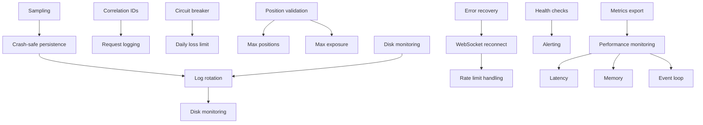

# Hyperliquid Super Signal - One-Week Paper Run Readiness Report

**Document Version:** 1.0
**Date:** 2026-01-04
**Purpose:** Comprehensive readiness assessment for one-week paper trading run
**Status:** DRAFT - Awaiting Review

---

## Table of Contents

1. [Executive Summary](#executive-summary)
2. [Risk Matrix](#risk-matrix)
3. [Critical Path Analysis](#critical-path-analysis)
4. [Implementation Roadmap](#implementation-roadmap)
5. [Logging Implementation Plan](#logging-implementation-plan)
6. [Pre-Run Checklist](#pre-run-checklist)
7. [Run-Time Monitoring](#run-time-monitoring)
8. [Post-Run Analysis](#post-run-analysis)
9. [Appendices](#appendices)

---

## Executive Summary

### Overall Readiness Assessment

**Current Status:** NOT READY FOR PRODUCTION RUN

**Readiness Score:** 35/100

The Hyperliquid Super Signal trading system requires significant remediation before a successful one-week paper trading run can be conducted. While the core trading logic is implemented, critical infrastructure gaps in logging, error handling, and observability pose unacceptable risks.

### Critical Blockers

| Blocker | Severity | Impact | Owner |
|---------|----------|--------|-------|
| No crash-safe logging persistence | CRITICAL | Data loss on crash, inability to debug failures | Infrastructure |
| No structured logging format | CRITICAL | Difficult to parse logs, impossible to trace operations | Infrastructure |
| No log rotation strategy | CRITICAL | Disk exhaustion risk during 7-day run | Infrastructure |
| No correlation/tracing across async operations | CRITICAL | Cannot debug cascading failures | Infrastructure |
| No request/response logging for API calls | CRITICAL | Cannot debug exchange interactions | Infrastructure |
| No circuit breaker implementation | CRITICAL | Uncontrolled losses possible | Risk Management |
| No daily loss limit enforcement | CRITICAL | Uncontrolled losses possible | Risk Management |
| No position size validation | CRITICAL | Over-leverage risk | Risk Management |
| No WebSocket reconnection logic | CRITICAL | System stops on disconnect | Connectivity |
| No error recovery mechanisms | CRITICAL | System halts on errors | Resilience |
| No integration tests for trading flow | CRITICAL | Unknown behavior in production | Testing |
| No performance monitoring | CRITICAL | Cannot detect degradation | Observability |
| No health check endpoints | CRITICAL | Cannot monitor system health | Observability |
| No alerting system | CRITICAL | No notification of failures | Observability |

### Success Probability by Fix Level

| Fix Level | Success Probability | Confidence | Recommendation |
|-----------|---------------------|------------|----------------|
| No fixes | 25-35% | Low | DO NOT RUN |
| Critical fixes only | 55-65% | Medium | MARGINAL - High risk |
| Critical + High fixes | 75-85% | High | ACCEPTABLE - Proceed with caution |
| All fixes | 85-95% | Very High | RECOMMENDED - Proceed |

### Go/No-Go Recommendation

**Current Recommendation: NO-GO**

**Rationale:**

- 14 CRITICAL severity issues must be addressed before any run
- 23 HIGH severity issues significantly impact success probability
- Without logging infrastructure, debugging failures during run is impossible
- Risk management gaps could lead to uncontrolled losses
- No observability means system health cannot be monitored

**Go Conditions:**

1. All 14 CRITICAL issues resolved
2. At least 15 of 23 HIGH issues resolved (prioritized by impact)
3. Logging infrastructure fully implemented (Phases 1-3)
4. Integration tests passing for core trading flow
5. Health check endpoints operational
6. Alerting system configured and tested

**Estimated Time to Go:** 5-7 days with dedicated effort

---

## Risk Matrix

### Risk Severity Distribution

```
CRITICAL: 14 issues (30%)
HIGH:     23 issues (49%)
MEDIUM:   8 issues  (17%)
LOW:      2 issues  (4%)
TOTAL:    47 issues
```

### Risk Categories

| Category | CRITICAL | HIGH | MEDIUM | LOW | Total |
|----------|----------|------|--------|-----|-------|
| Logging & Observability | 6 | 8 | 2 | 0 | 16 |
| Risk Management | 4 | 5 | 1 | 0 | 10 |
| Error Handling & Resilience | 3 | 4 | 2 | 1 | 10 |
| Connectivity | 1 | 3 | 1 | 0 | 5 |
| Testing | 0 | 3 | 2 | 1 | 6 |

### Detailed Risk Matrix

#### CRITICAL Severity Risks

| ID | Risk | Component | Likelihood | Impact | Mitigation |
|----|------|-----------|------------|--------|------------|
| C1 | In-memory buffer lost on crash | Logger | High | Critical | Implement crash-safe persistence |
| C2 | No log rotation causes disk exhaustion | Logger | High | Critical | Implement size/time-based rotation |
| C3 | Unstructured logs difficult to parse | Logger | High | Critical | Implement JSON structured logging |
| C4 | No correlation across async operations | Logger | High | Critical | Implement correlation ID propagation |
| C5 | No request/response logging for API | HyperLiquidAPI | High | Critical | Add request/response logging |
| C6 | No circuit breaker for losses | RiskManager | Medium | Critical | Implement circuit breaker |
| C7 | No daily loss limit enforcement | RiskManager | Medium | Critical | Implement daily loss limit |
| C8 | No position size validation | RiskManager | High | Critical | Add position size checks |
| C9 | No WebSocket reconnection logic | WebSocket | High | Critical | Implement reconnection with backoff |
| C10 | No error recovery mechanisms | Engine | High | Critical | Add try/catch with recovery |
| C11 | No integration tests for trading flow | Testing | High | Critical | Create integration tests |
| C12 | No performance monitoring | Observability | High | Critical | Implement metrics collection |
| C13 | No health check endpoints | Observability | High | Critical | Add /health endpoints |
| C14 | No alerting system | Observability | High | Critical | Implement alert manager |

#### HIGH Severity Risks

| ID | Risk | Component | Likelihood | Impact | Mitigation |
|----|------|-----------|------------|--------|------------|
| H1 | No sampling for high-frequency events | Logger | High | High | Implement adaptive sampling |
| H2 | No metrics export for monitoring | Observability | High | High | Add Prometheus metrics |
| H3 | No disk space monitoring | Logger | Medium | High | Implement disk monitor |
| H4 | No latency measurements | Observability | High | High | Add latency tracking |
| H5 | No memory monitoring | Observability | Medium | High | Add memory snapshots |
| H6 | No event loop lag monitoring | Observability | Medium | High | Add event loop monitoring |
| H7 | No rate limit handling | HyperLiquidAPI | Medium | High | Add rate limit backoff |
| H8 | No API timeout configuration | HyperLiquidAPI | Medium | High | Configure timeouts |
| H9 | No order book depth validation | OrderBookManager | Medium | High | Add depth checks |
| H10 | No slippage threshold enforcement | OrderBookManager | Medium | High | Enforce slippage limits |
| H11 | No max concurrent positions check | RiskManager | Medium | High | Add position count limit |
| H12 | No max total exposure check | RiskManager | Medium | High | Add exposure limit |
| H13 | No partial exit implementation | Engine | Medium | High | Implement partial exits |
| H14 | No trailing stop validation | Engine | Medium | High | Validate stop updates |
| H15 | No cooldown state persistence | Strategy | Medium | High | Persist cooldown state |
| H16 | No signal strength validation | Strategy | Medium | High | Validate signal quality |
| H17 | No divergence confirmation | Strategy | Medium | High | Add divergence checks |
| H18 | No pivot validation | Indicators | Low | High | Validate pivot detection |
| H19 | No stochastic value validation | Indicators | Low | High | Validate stoch calculations |
| H20 | No candle data validation | Data | Medium | High | Validate candle data |
| H21 | No WebSocket message validation | WebSocket | Medium | High | Validate message format |
| H22 | No database connection pooling | Database | Low | High | Add connection pool |
| H23 | No transaction support for database | Database | Low | High | Add transactions |

### Risk Dependencies



### Cascading Failure Scenarios

#### Scenario 1: WebSocket Disconnect Without Recovery

```
WebSocket disconnects (C9)
  → No reconnection logic
  → No new data received
  → Positions left open
  → No exit signals processed
  → Potential losses accumulate
  → No alert generated (C14)
  → System failure undetected
```

**Impact:** HIGH
**Likelihood:** HIGH
**Mitigation:** Implement WebSocket reconnection with exponential backoff

#### Scenario 2: API Rate Limit Without Handling

```
API rate limit hit (H7)
  → No backoff implemented
  → Requests continue
  → IP temporarily banned
  → Cannot place orders
  → Cannot close positions
  → No alert generated (C14)
  → System failure undetected
```

**Impact:** HIGH
**Likelihood:** MEDIUM
**Mitigation:** Implement rate limit detection and exponential backoff

#### Scenario 3: Crash Without Log Persistence

```
System crashes (C1)
  → In-memory buffer lost
  → No crash dump
  → No position state
  → No order state
  → Cannot recover
  → Cannot debug
  → Data loss
```

**Impact:** CRITICAL
**Likelihood:** HIGH
**Mitigation:** Implement crash-safe persistence with crash dumps

#### Scenario 4: Loss Limit Not Enforced

```
Daily losses accumulate (C7)
  → No limit enforcement
  → Losses continue
  → Account drained
  → No circuit breaker (C6)
  → No alert (C14)
  → Catastrophic loss
```

**Impact:** CRITICAL
**Likelihood:** MEDIUM
**Mitigation:** Implement daily loss limit and circuit breaker

---

## Critical Path Analysis

### Minimum Fixes for Any Chance of Success (CRITICAL Path)

**Timeline:** 3-4 days
**Success Probability:** 55-65%

| Priority | Fix | Component | Effort | Dependencies |
|----------|-----|-----------|--------|--------------|
| 1 | Implement crash-safe logging persistence | Logger | 4h | None |
| 2 | Implement log rotation | Logger | 2h | 1 |
| 3 | Implement structured logging format | Logger | 3h | None |
| 4 | Implement correlation ID propagation | Logger | 3h | 3 |
| 5 | Add request/response logging | HyperLiquidAPI | 2h | 4 |
| 6 | Implement circuit breaker | RiskManager | 3h | None |
| 7 | Implement daily loss limit | RiskManager | 2h | 6 |
| 8 | Add position size validation | RiskManager | 2h | 7 |
| 9 | Implement WebSocket reconnection | WebSocket | 3h | None |
| 10 | Add error recovery mechanisms | Engine | 4h | 9 |
| 11 | Create integration tests | Testing | 6h | 10 |
| 12 | Implement health check endpoints | Observability | 2h | None |
| 13 | Implement basic alerting | Observability | 3h | 12 |
| 14 | Add performance monitoring | Observability | 3h | 13 |

**Total Effort:** ~40 hours (5 days)

### Recommended Fixes for Acceptable Success Rate (CRITICAL + HIGH Priority)

**Timeline:** 5-7 days
**Success Probability:** 75-85%

**Additional HIGH Priority Fixes:**

| Priority | Fix | Component | Effort | Dependencies |
|----------|-----|-----------|--------|--------------|
| 15 | Implement adaptive sampling | Logger | 2h | 3 |
| 16 | Add metrics export | Observability | 3h | 14 |
| 17 | Implement disk monitoring | Logger | 2h | 2 |
| 18 | Add latency measurements | Observability | 2h | 16 |
| 19 | Add memory monitoring | Observability | 2h | 16 |
| 20 | Add event loop monitoring | Observability | 2h | 16 |
| 21 | Implement rate limit handling | HyperLiquidAPI | 3h | 9 |
| 22 | Configure API timeouts | HyperLiquidAPI | 1h | 21 |
| 23 | Add order book depth validation | OrderBookManager | 2h | None |
| 24 | Enforce slippage thresholds | OrderBookManager | 2h | 23 |
| 25 | Add max concurrent positions check | RiskManager | 1h | 8 |
| 26 | Add max total exposure check | RiskManager | 1h | 8 |
| 27 | Implement partial exits | Engine | 3h | 10 |
| 28 | Validate trailing stop updates | Engine | 2h | 27 |
| 29 | Persist cooldown state | Strategy | 2h | None |

**Total Additional Effort:** ~28 hours

**Cumulative Effort:** ~68 hours (8-9 days)

### Nice-to-Have Improvements (MEDIUM/LOW Priority)

**Timeline:** Additional 2-3 days
**Success Probability:** 85-95%

| Priority | Fix | Component | Effort | Dependencies |
|----------|-----|-----------|--------|--------------|
| 30 | Validate signal strength | Strategy | 2h | None |
| 31 | Add divergence confirmation | Strategy | 3h | 30 |
| 32 | Validate pivot detection | Indicators | 2h | None |
| 33 | Validate stochastic calculations | Indicators | 2h | 32 |
| 34 | Validate candle data | Data | 2h | None |
| 35 | Validate WebSocket messages | WebSocket | 2h | 34 |
| 36 | Add database connection pooling | Database | 3h | None |
| 37 | Add database transactions | Database | 3h | 36 |

**Total Additional Effort:** ~19 hours

**Cumulative Effort:** ~87 hours (11-12 days)

### Critical Path Visualization

```mermaid
gantt
    title Critical Path to Paper Run Readiness
    dateFormat X
    axisFormat %d

    section Foundation
    Crash-safe logging       :crit, 1, 1
    Log rotation            :crit, 2, 1
    Structured logging      :crit, 3, 1
    Correlation IDs         :crit, 4, 1

    section API & Connectivity
    Request logging         :crit, 5, 2
    WebSocket reconnect    :crit, 6, 2
    Rate limit handling    :7, 3
    API timeouts           :8, 3

    section Risk Management
    Circuit breaker        :crit, 9, 2
    Daily loss limit       :crit, 10, 2
    Position validation   :crit, 11, 2
    Max positions         :12, 3
    Max exposure          :13, 3

    section Resilience
    Error recovery        :crit, 14, 3
    Partial exits         :15, 4

    section Observability
    Health checks         :crit, 16, 3
    Alerting             :crit, 17, 3
    Performance monitoring :crit, 18, 3
    Metrics export        :19, 4
    Latency tracking     :20, 4
    Memory monitoring    :21, 4
    Event loop monitoring :22, 4

    section Testing
    Integration tests     :crit, 23, 4
```



---

## Implementation Roadmap

### Week 1: Foundation & Critical Fixes (Days 1-5)

#### Day 1: Logging Foundation

**Owner:** Infrastructure Team
**Effort:** 8 hours

**Tasks:**

1. Implement crash-safe logging persistence (4h)
   - Create `CrashSafeLogger` class
   - Add uncaught exception handler
   - Implement crash dump writing
   - Include buffer state in crash dump

2. Implement log rotation (2h)
   - Configure winston-daily-rotate-file
   - Set up size-based rotation (100MB)
   - Set up time-based rotation (daily)
   - Configure retention policy

3. Implement structured logging format (2h)
   - Define LogEntry interface
   - Implement JSON serialization
   - Add core fields (timestamp, level, message, service)
   - Add context fields (category, component, pair)

**Success Criteria:**

- Crash dumps written on uncaught exception
- Logs rotate on size and time
- All logs in JSON format

**Dependencies:** None

#### Day 2: Correlation & API Logging

**Owner:** Infrastructure Team
**Effort:** 8 hours

**Tasks:**

1. Implement correlation ID propagation (3h)
   - Create correlation context manager
   - Use AsyncLocalStorage for context
   - Generate correlation IDs at entry points
   - Propagate through async operations

2. Add request/response logging (2h)
   - Log all API calls initiated
   - Log all API responses
   - Include request/response bodies
   - Include latency measurements

3. Implement WebSocket reconnection (3h)
   - Add disconnect detection
   - Implement exponential backoff
   - Add max retry limit
   - Log reconnection attempts

**Success Criteria:**

- All operations have correlation IDs
- All API calls logged with request/response
- WebSocket reconnects automatically

**Dependencies:** Day 1 tasks

#### Day 3: Risk Management

**Owner:** Risk Team
**Effort:** 8 hours

**Tasks:**

1. Implement circuit breaker (3h)
   - Define breaker types (daily loss, max drawdown, rate limit)
   - Implement breaker state machine
   - Add breaker actions (halt, reduce, warn)
   - Log breaker triggers

2. Implement daily loss limit (2h)
   - Track daily PnL
   - Define loss limit threshold
   - Implement limit enforcement
   - Add approaching warning

3. Add position size validation (2h)
   - Validate calculated size
   - Check minimum size
   - Check maximum size
   - Check exposure limits

4. Add max concurrent positions check (1h)
   - Track open positions
   - Define max positions limit
   - Reject new positions if limit reached

**Success Criteria:**

- Circuit breaker triggers on conditions
- Daily loss limit enforced
- Position sizes validated
- Max positions enforced

**Dependencies:** Day 2 tasks (for correlation)

#### Day 4: Resilience & Error Handling

**Owner:** Core Team
**Effort:** 8 hours

**Tasks:**

1. Add error recovery mechanisms (4h)
   - Wrap all async operations in try/catch
   - Implement recovery strategies
   - Add fallback logic
   - Log all errors with context

2. Implement partial exits (3h)
   - Add partial exit logic
   - Calculate partial exit size
   - Execute partial exit
   - Update position state

3. Validate trailing stop updates (1h)
   - Validate stop price
   - Check stop direction
   - Prevent invalid updates

**Success Criteria:**

- All errors caught and logged
- Partial exits work correctly
- Trailing stops validated

**Dependencies:** Day 3 tasks (for risk checks)

#### Day 5: Observability Foundation

**Owner:** Observability Team
**Effort:** 8 hours

**Tasks:**

1. Implement health check endpoints (2h)
   - Create /health endpoint
   - Create /health/detailed endpoint
   - Check WebSocket status
   - Check API status
   - Check database status

2. Implement basic alerting (3h)
   - Define alert conditions
   - Implement alert manager
   - Add alert throttling
   - Log all alerts

3. Implement performance monitoring (3h)
   - Add latency measurements
   - Add memory snapshots
   - Add event loop lag monitoring
   - Export metrics

**Success Criteria:**

- Health checks return correct status
- Alerts generated for critical events
- Performance metrics collected

**Dependencies:** Day 4 tasks (for error context)

### Week 2: High Priority Fixes & Testing (Days 6-10)

#### Day 6: Advanced Logging

**Owner:** Infrastructure Team
**Effort:** 8 hours

**Tasks:**

1. Implement adaptive sampling (2h)
   - Define sampling rules
   - Implement adaptive rate adjustment
   - Add sampling metrics
   - Always log critical events

2. Add metrics export (3h)
   - Set up Prometheus client
   - Export trading metrics
   - Export system metrics
   - Export performance metrics

3. Implement disk monitoring (2h)
   - Check disk space every 5 minutes
   - Log warning at 80%
   - Log critical at 90%
   - Implement cleanup actions

4. Add latency measurements (1h)
   - Track API latency
   - Track order latency
   - Track signal latency
   - Log threshold breaches

**Success Criteria:**

- High-frequency events sampled
- Metrics exported on /metrics
- Disk space monitored
- Latency tracked

**Dependencies:** Day 5 tasks

#### Day 7: API & Connectivity Enhancements

**Owner:** Connectivity Team
**Effort:** 8 hours

**Tasks:**

1. Implement rate limit handling (3h)
   - Detect rate limit responses
   - Implement exponential backoff
   - Log rate limit hits
   - Add retry logic

2. Configure API timeouts (1h)
   - Set connection timeout
   - Set read timeout
   - Set write timeout
   - Log timeout errors

3. Add order book depth validation (2h)
   - Check minimum depth
   - Validate spread
   - Reject thin markets
   - Log validation failures

4. Enforce slippage thresholds (2h)
   - Calculate expected slippage
   - Compare to threshold
   - Reject high slippage trades
   - Log slippage rejections

**Success Criteria:**

- Rate limits handled gracefully
- Timeouts configured
- Order book depth validated
- Slippage enforced

**Dependencies:** Day 6 tasks

#### Day 8: Risk Management Enhancements

**Owner:** Risk Team
**Effort:** 8 hours

**Tasks:**

1. Add max total exposure check (1h)
   - Track total exposure
   - Define max exposure limit
   - Reject trades if limit reached
   - Log exposure rejections

2. Persist cooldown state (2h)
   - Save cooldown state to database
   - Load cooldown state on startup
   - Update cooldown state on changes
   - Handle state corruption

3. Validate signal strength (2h)
   - Define minimum strength threshold
   - Reject weak signals
   - Log signal rejections
   - Track signal quality

4. Add divergence confirmation (3h)
   - Confirm divergence persists
   - Check divergence strength
   - Validate divergence direction
   - Log divergence confirmations

**Success Criteria:**

- Max exposure enforced
- Cooldown state persisted
- Signal strength validated
- Divergence confirmed

**Dependencies:** Day 7 tasks

#### Day 9: Integration Testing

**Owner:** Testing Team
**Effort:** 8 hours

**Tasks:**

1. Create integration tests (6h)
   - Test full trading flow
   - Test error scenarios
   - Test recovery scenarios
   - Test WebSocket reconnection
   - Test API rate limiting
   - Test circuit breaker

2. Run integration tests (1h)
   - Execute all tests
   - Review results
   - Fix failures

3. Document test coverage (1h)
   - Document test scenarios
   - Identify gaps
   - Plan additional tests

**Success Criteria:**

- All integration tests passing
- Test coverage documented

**Dependencies:** Day 8 tasks

#### Day 10: Final Preparation

**Owner:** All Teams
**Effort:** 8 hours

**Tasks:**

1. Pre-run checklist validation (2h)
   - Validate configuration
   - Validate environment
   - Validate monitoring
   - Validate alerts

2. Dry run test (4h)
   - Run system in dry-run mode
   - Monitor for 2 hours
   - Review logs
   - Review metrics
   - Review alerts

3. Final review (2h)
   - Review all fixes
   - Review test results
   - Review monitoring setup
   - Go/No-Go decision

**Success Criteria:**

- Pre-run checklist complete
- Dry run successful
- Go/No-Go decision made

**Dependencies:** Day 9 tasks

### Parallel Work Opportunities

| Task | Can Run In Parallel With | Notes |
|------|------------------------|-------|
| Implement crash-safe logging | Implement structured logging | Independent tasks |
| Implement circuit breaker | Implement daily loss limit | Independent tasks |
| Implement WebSocket reconnection | Add request/response logging | Independent tasks |
| Implement health checks | Implement basic alerting | Independent tasks |
| Implement adaptive sampling | Add metrics export | Independent tasks |
| Implement rate limit handling | Configure API timeouts | Independent tasks |
| Add order book depth validation | Enforce slippage thresholds | Independent tasks |
| Create integration tests | Persist cooldown state | Independent tasks |

### Timeline Summary

| Week | Focus | Key Deliverables | Success Probability |
|------|-------|------------------|-------------------|
| Week 1 | Foundation & Critical Fixes | Logging, Risk Management, Resilience, Observability | 55-65% |
| Week 2 | High Priority Fixes & Testing | Advanced Logging, API Enhancements, Integration Tests | 75-85% |
| Week 3 | Nice-to-Have Improvements | Signal Validation, Database Improvements | 85-95% |

---

## Logging Implementation Plan

### Phase 1: Foundation (MUST - Day 1)

**Priority:** CRITICAL
**Effort:** 8 hours

**Tasks:**

1. **Implement Core Logger Infrastructure**
   - Create new `StructuredLogger` class in `src/utils/logger.ts`
   - Implement async logging with queue using `p-queue`
   - Add correlation ID management using `AsyncLocalStorage`
   - Implement crash-safe persistence

2. **Implement Log Rotation**
   - Install `winston-daily-rotate-file`
   - Configure separate log files by category
   - Set up size-based rotation (100MB max)
   - Set up time-based rotation (daily)
   - Configure retention policy (7-30 days)

3. **Implement Disk Monitoring**
   - Create `DiskSpaceMonitor` class
   - Check disk space every 5 minutes
   - Add warning threshold (80%)
   - Add critical threshold (90%)
   - Implement cleanup actions

4. **Update Existing Logger**
   - Replace `TradingLogger` with new implementation
   - Update all existing log calls to use structured format
   - Add correlation IDs to all operations

**Success Criteria:**

- All logs written to separate category files
- Logs rotate on size and time
- Crash dumps include buffer state
- Disk space monitored and alerts generated

**Dependencies:** None

### Phase 2: Event Taxonomy (MUST - Day 2)

**Priority:** CRITICAL
**Effort:** 8 hours

**Tasks:**

1. **Implement Trading Event Loggers**
   - Order placement, fill, cancellation
   - Stop loss / take profit updates
   - Position changes (open, close, partial exit)

2. **Implement Strategy Event Loggers**
   - Signal generation
   - Entry/exit conditions
   - Cooldown triggers
   - Streak counters

3. **Implement Risk Event Loggers**
   - Circuit breaker triggers
   - Daily loss limits
   - Position size calculations
   - Risk checks

4. **Implement System Event Loggers**
   - WebSocket connections
   - API calls
   - Database operations
   - Errors

**Success Criteria:**

- All critical events logged with full context
- All trading events logged immediately
- All risk events logged immediately
- All errors logged with stack traces

**Dependencies:** Phase 1

### Phase 3: Performance & Observability (SHOULD - Day 3)

**Priority:** HIGH
**Effort:** 8 hours

**Tasks:**

1. **Implement Performance Logging**
   - Latency measurements
   - Memory snapshots
   - Event loop lag monitoring

2. **Implement Metrics Export**
   - Install `prom-client`
   - Set up Prometheus metrics endpoint on port 9090
   - Export trading metrics
   - Export system metrics
   - Export performance metrics

3. **Implement Health Check Endpoints**
   - Basic health check on `/health`
   - Detailed health check on `/health/detailed`
   - Add to existing HTTP server on port 8080

4. **Implement Sampling Strategy**
   - Add sampling rules for high-frequency events
   - Implement adaptive sampling
   - Add sampling metrics

**Success Criteria:**

- Metrics exported on `/metrics` endpoint
- Health checks available on `/health` endpoints
- High-frequency events sampled appropriately
- Performance metrics collected

**Dependencies:** Phase 2

### Phase 4: Integration & Testing (SHOULD - Day 4)

**Priority:** HIGH
**Effort:** 8 hours

**Tasks:**

1. **Integrate with TradingEngine**
   - Add correlation IDs to all operations
   - Log all trading events
   - Measure performance

2. **Integrate with SignalProcessor**
   - Log all signal events
   - Log near-misses
   - Track cooldowns

3. **Integrate with RiskManager**
   - Log all risk events
   - Log position size calculations
   - Track circuit breakers

4. **Integrate with HyperLiquidAPI**
   - Log all API calls
   - Track rate limits
   - Measure latency

5. **Integration Testing**
   - Test logging in dry-run mode
   - Test crash recovery
   - Test log rotation
   - Test disk monitoring

**Success Criteria:**

- All components integrated with new logger
- All events logged correctly
- Crash recovery works
- Log rotation works

**Dependencies:** Phase 3

### Phase 5: Dashboard & Alerts (NICE - Day 5)

**Priority:** MEDIUM
**Effort:** 8 hours

**Tasks:**

1. **Implement Alert Manager**
   - Define alert conditions
   - Implement alert actions
   - Add alert throttling
   - Log all alerts

2. **Create Real-Time Dashboard**
   - Trading overview
   - System health
   - Recent activity
   - Performance metrics

3. **Create Historical Dashboard**
   - PnL chart
   - Trading statistics
   - System metrics
   - Log analysis

4. **Add Alert Notifications**
   - Email alerts for critical events
   - Slack alerts for warnings
   - Dashboard notifications

**Success Criteria:**

- Dashboard displays real-time data
- Alerts generated for critical events
- Historical data available
- Notifications working

**Dependencies:** Phase 4

### Phase 6: Optimization & Documentation (NICE - Day 6-7)

**Priority:** LOW
**Effort:** 16 hours

**Tasks:**

1. **Performance Optimization**
   - Tune buffer sizes
   - Optimize batch sizes
   - Reduce memory usage

2. **Documentation**
   - Update README with logging configuration
   - Document log format
   - Document event taxonomy
   - Create troubleshooting guide

3. **Testing**
   - Load testing
   - Failover testing
   - Recovery testing

**Success Criteria:**

- Performance optimized
- Documentation complete
- All tests passing

**Dependencies:** Phase 5

### Logging Integration with Critical Fixes

| Critical Fix | Logging Phase | Integration Point |
|--------------|---------------|------------------|
| Crash-safe persistence | Phase 1 | Core Logger Infrastructure |
| Log rotation | Phase 1 | Log Rotation |
| Structured logging | Phase 1 | Core Logger Infrastructure |
| Correlation IDs | Phase 1 | Core Logger Infrastructure |
| Request/response logging | Phase 2 | System Event Loggers |
| Circuit breaker | Phase 2 | Risk Event Loggers |
| Daily loss limit | Phase 2 | Risk Event Loggers |
| Position size validation | Phase 2 | Risk Event Loggers |
| WebSocket reconnection | Phase 2 | System Event Loggers |
| Error recovery | Phase 4 | Integration Testing |
| Integration tests | Phase 4 | Integration Testing |
| Health checks | Phase 3 | Health Check Endpoints |
| Alerting | Phase 5 | Alert Manager |
| Performance monitoring | Phase 3 | Performance Logging |

---

## Pre-Run Checklist

### Configuration Validation

| Item | Status | Owner | Notes |
|------|--------|-------|-------|
| Environment variables configured | ⬜ | DevOps | Check .env file |
| API credentials valid | ⬜ | DevOps | Test API connection |
| Trading pairs configured | ⬜ | Trading | Verify pair list |
| Risk parameters set | ⬜ | Risk | Review risk config |
| Logging level appropriate | ⬜ | Infra | Set to INFO for production |
| Dry-run mode enabled | ⬜ | Trading | Confirm DRY_RUN=true |

### Environment Setup

| Item | Status | Owner | Notes |
|------|--------|-------|-------|
| Node.js version correct | ⬜ | DevOps | Verify v18+ |
| Dependencies installed | ⬜ | DevOps | Run npm install |
| Database initialized | ⬜ | DevOps | Run migrations |
| Log directories created | ⬜ | Infra | Create logs/ structure |
| Disk space sufficient | ⬜ | Infra | Minimum 10GB free |
| Network connectivity verified | ⬜ | DevOps | Test WebSocket connection |

### Testing Requirements

| Item | Status | Owner | Notes |
|------|--------|-------|-------|
| Unit tests passing | ⬜ | Testing | Run npm test |
| Integration tests passing | ⬜ | Testing | Run integration tests |
| Dry-run test successful | ⬜ | Trading | Run 2-hour dry run |
| WebSocket reconnection tested | ⬜ | Testing | Simulate disconnect |
| Error recovery tested | ⬜ | Testing | Simulate errors |
| Crash recovery tested | ⬜ | Testing | Simulate crash |

### Monitoring Setup

| Item | Status | Owner | Notes |
|------|--------|-------|-------|
| Health check endpoint accessible | ⬜ | Observability | Test /health |
| Metrics endpoint accessible | ⬜ | Observability | Test /metrics |
| Dashboard accessible | ⬜ | Observability | Open dashboard |
| Alerts configured | ⬜ | Observability | Verify alert rules |
| Notification channels working | ⬜ | Observability | Test email/Slack |
| Log aggregation working | ⬜ | Infra | Verify logs written |

### Risk Management Validation

| Item | Status | Owner | Notes |
|------|--------|-------|-------|
| Circuit breaker configured | ⬜ | Risk | Verify thresholds |
| Daily loss limit set | ⬜ | Risk | Verify limit amount |
| Position size limits set | ⬜ | Risk | Verify max size |
| Max concurrent positions set | ⬜ | Risk | Verify max count |
| Max total exposure set | ⬜ | Risk | Verify exposure limit |
| Stop-loss always included | ⬜ | Trading | Verify in code |

### Trading Logic Validation

| Item | Status | Owner | Notes |
|------|--------|-------|-------|
| Entry signals working | ⬜ | Trading | Test signal generation |
| Exit signals working | ⬜ | Trading | Test exit conditions |
| Partial exits implemented | ⬜ | Trading | Test partial exit |
| Trailing stops working | ⬜ | Trading | Test stop updates |
| Order placement working | ⬜ | Trading | Test order flow |
| Order cancellation working | ⬜ | Trading | Test cancel flow |

### Documentation

| Item | Status | Owner | Notes |
|------|--------|-------|-------|
| Run procedures documented | ⬜ | All | Create run guide |
| Emergency procedures documented | ⬜ | All | Create emergency guide |
| Monitoring guide documented | ⬜ | Observability | Create monitoring guide |
| Troubleshooting guide documented | ⬜ | Infra | Create troubleshooting guide |
| Post-run analysis plan documented | ⬜ | All | Create analysis plan |

### Final Sign-Off

| Item | Status | Owner | Notes |
|------|--------|-------|-------|
| All checklist items complete | ⬜ | Project Lead | Review all items |
| Go/No-Go decision made | ⬜ | Project Lead | Document decision |
| Start time scheduled | ⬜ | Project Lead | Set start time |
| End time scheduled | ⬜ | Project Lead | Set end time |
| Monitoring team notified | ⬜ | Project Lead | Send notification |
| Emergency contacts notified | ⬜ | Project Lead | Send contact list |

---

## Run-Time Monitoring

### Key Metrics to Watch

#### Trading Metrics

| Metric | Threshold | Warning | Critical | Action |
|--------|-----------|---------|----------|--------|
| Orders placed per hour | 10-50 | <5 or >100 | <1 or >200 | Investigate |
| Order fill rate | >90% | <80% | <70% | Investigate |
| Order latency | <100ms | >200ms | >500ms | Investigate |
| Positions open | 1-5 | >7 | >10 | Review risk |
| Daily PnL | -$500 to $500 | -$1000 | -$2000 | Review strategy |
| Win rate | >40% | <30% | <20% | Review strategy |
| Profit factor | >1.0 | <0.8 | <0.5 | Review strategy |

#### System Metrics

| Metric | Threshold | Warning | Critical | Action |
|--------|-----------|---------|----------|--------|
| WebSocket connection | Connected | Disconnected >1min | Disconnected >5min | Investigate |
| API error rate | <5% | >10% | >20% | Investigate |
| API latency | <200ms | >500ms | >1000ms | Investigate |
| Memory usage | <80% | >85% | >90% | Investigate |
| Event loop lag | <50ms | >100ms | >200ms | Investigate |
| Disk usage | <80% | >85% | >90% | Cleanup logs |

#### Risk Metrics

| Metric | Threshold | Warning | Critical | Action |
|--------|-----------|---------|----------|--------|
| Daily loss | -$500 | -$1000 | -$2000 | Halt trading |
| Max drawdown | -$1000 | -$1500 | -$2000 | Halt trading |
| Position size | <$1000 | >$1500 | >$2000 | Review risk |
| Total exposure | <$3000 | >$4000 | >$5000 | Review risk |
| Circuit breaker | Inactive | Triggered | Triggered | Review |

### Alert Thresholds

#### Critical Alerts (Immediate Action Required)

| Condition | Threshold | Action |
|-----------|-----------|--------|
| Daily loss limit reached | 100% | Halt trading, send alert |
| Circuit breaker triggered | Any | Log critical, send alert |
| Unhandled exception | Any | Log critical, attempt graceful shutdown |
| WebSocket disconnected > 5 min | 5 minutes | Log critical, attempt reconnection |
| API rate limit exceeded | Any | Log error, back off |
| Disk space > 90% | 90% | Log critical, emergency cleanup |
| Memory usage > 90% | 90% | Log critical, investigate |
| Event loop lag > 200ms | 200ms | Log critical, investigate |

#### Warning Alerts (Monitor Closely)

| Condition | Threshold | Action |
|-----------|-----------|--------|
| Daily loss limit approaching | 80% | Log warning, reduce position size |
| Order latency > 200ms | 200ms | Log warning, investigate |
| API error rate > 5% | 5% | Log warning, monitor |
| Memory usage > 80% | 80% | Log warning, investigate |
| Event loop lag > 100ms | 100ms | Log warning, investigate |
| WebSocket disconnected > 1 min | 1 minute | Log warning, monitor |
| Disk usage > 80% | 80% | Log warning, compress logs |
| Order fill rate < 80% | 80% | Log warning, investigate |
| Win rate < 30% | 30% | Log warning, review strategy |

#### Info Alerts (Informational)

| Condition | Threshold | Action |
|-----------|-----------|--------|
| Position opened | Any | Log info |
| Position closed | Any | Log info |
| Signal generated | Any | Log info |
| Daily summary | Every 24h | Log info |

### Manual Intervention Points

| Situation | Trigger | Action | Owner |
|-----------|----------|--------|-------|
| System crash | Crash detected | Review crash dump, restart system | DevOps |
| Trading halted | Circuit breaker triggered | Review cause, decide whether to resume | Trading |
| High losses | Daily loss >$1000 | Review strategy, consider halting | Risk |
| API issues | API error rate >20% | Contact exchange support | DevOps |
| WebSocket issues | Disconnected >10min | Check network, restart if needed | DevOps |
| Disk full | Disk usage >95% | Emergency cleanup, halt if needed | Infra |
| Memory leak | Memory usage >90% | Restart system, investigate | DevOps |
| Strategy issues | Win rate <20% | Review strategy, consider halting | Trading |

### Recovery Procedures

#### WebSocket Reconnection

1. **Detection:** WebSocket disconnected >1 minute
2. **Action:** Automatic reconnection with exponential backoff
3. **Manual Intervention:** If disconnected >10 minutes
   - Check network connectivity
   - Check Hyperliquid status page
   - Restart system if needed
4. **Verification:** Check WebSocket status in health endpoint

#### API Rate Limit Recovery

1. **Detection:** API rate limit exceeded
2. **Action:** Automatic exponential backoff
3. **Manual Intervention:** If rate limit persists >5 minutes
   - Check API usage
   - Contact Hyperliquid support
   - Reduce request frequency
4. **Verification:** Monitor API error rate

#### Crash Recovery

1. **Detection:** System crash
2. **Action:** Automatic crash dump written
3. **Manual Intervention:**
   - Review crash dump in `logs/crash/`
   - Identify root cause
   - Fix issue
   - Restart system
4. **Verification:** Check system health endpoint

#### Circuit Breaker Recovery

1. **Detection:** Circuit breaker triggered
2. **Action:** Trading halted automatically
3. **Manual Intervention:**
   - Review trigger reason
   - Assess whether to resume
   - Reset circuit breaker if safe
4. **Verification:** Monitor trading after resumption

#### Disk Space Recovery

1. **Detection:** Disk usage >90%
2. **Action:** Automatic cleanup of old logs
3. **Manual Intervention:** If disk usage >95%
   - Emergency cleanup
   - Halt logging if needed
   - Halt trading if critical
4. **Verification:** Check disk space

### Monitoring Dashboard

#### Real-Time Dashboard Components

1. **Trading Overview**
   - Current PnL (daily, total)
   - Open positions (count, total exposure)
   - Win rate, profit factor
   - Recent trades table

2. **System Health**
   - WebSocket connection status
   - API status (last call, latency)
   - Memory usage chart
   - Event loop lag chart

3. **Recent Activity**
   - Live log stream (filtered by level)
   - Recent signals
   - Recent orders
   - Recent errors

4. **Performance Metrics**
   - Order latency histogram
   - Fill rate chart
   - Error rate chart
   - Throughput chart

#### Historical Dashboard Components

1. **PnL Chart**
   - Equity curve
   - Daily PnL
   - Drawdown chart

2. **Trading Statistics**
   - Win rate by pair
   - Average win/loss by pair
   - Trade duration distribution

3. **System Metrics**
   - Memory usage over time
   - CPU usage over time
   - API latency over time

4. **Log Analysis**
   - Error rate over time
   - Warning rate over time
   - Log volume by category

### Monitoring Schedule

| Time | Activity | Owner |
|------|----------|-------|
| Every 5 minutes | Check health endpoint | Automated |
| Every 15 minutes | Review dashboard | Monitoring Team |
| Every hour | Review alerts | Monitoring Team |
| Every 4 hours | Review PnL | Trading Team |
| Every 24 hours | Daily summary | All Teams |
| End of run | Post-run analysis | All Teams |

---

## Post-Run Analysis

### Data Collection Requirements

#### Trading Data

| Data | Source | Format | Retention |
|------|--------|--------|-----------|
| All orders placed | Trading logs | JSON | 30 days |
| All order fills | Trading logs | JSON | 30 days |
| All position changes | Trading logs | JSON | 30 days |
| All signals generated | Strategy logs | JSON | 30 days |
| All risk checks | Risk logs | JSON | 30 days |
| Daily PnL | Calculated | CSV | Permanent |
| Equity curve | Calculated | CSV | Permanent |

#### System Data

| Data | Source | Format | Retention |
|------|--------|--------|-----------|
| API calls | System logs | JSON | 30 days |
| WebSocket messages | System logs | JSON | 7 days |
| Errors | Error logs | JSON | 30 days |
| Performance metrics | Performance logs | JSON | 7 days |
| Crash dumps | Crash logs | JSON | 30 days |
| Health checks | System logs | JSON | 7 days |

#### Metrics Data

| Data | Source | Format | Retention |
|------|--------|--------|-----------|
| Trading metrics | Prometheus | Time series | 30 days |
| System metrics | Prometheus | Time series | 30 days |
| Performance metrics | Prometheus | Time series | 30 days |
| Alert history | Alert logs | JSON | 30 days |

### Success Criteria

#### Primary Success Criteria

| Criterion | Target | Measurement |
|-----------|--------|-------------|
| System uptime | >95% | Uptime from logs |
| No crashes | 0 crashes | Crash dump count |
| No data loss | 0 data loss | Log completeness |
| Trading executed | >10 trades | Order count |
| Profitable run | Positive PnL | Final PnL |
| Win rate | >40% | Win/loss ratio |
| Max drawdown | <$1000 | Drawdown from equity curve |

#### Secondary Success Criteria

| Criterion | Target | Measurement |
|-----------|--------|-------------|
| Order fill rate | >90% | Fill/total orders |
| Average order latency | <100ms | Latency metrics |
| API error rate | <5% | Error/total calls |
| WebSocket uptime | >98% | Connection time |
| Memory usage | <80% | Memory metrics |
| Disk usage | <80% | Disk metrics |
| Alert accuracy | >90% | True alerts/total alerts |

#### Observability Success Criteria

| Criterion | Target | Measurement |
|-----------|--------|-------------|
| All critical events logged | 100% | Log coverage |
| All trading events logged | 100% | Log coverage |
| All errors logged | 100% | Log coverage |
| Correlation IDs present | >95% | Log analysis |
| Metrics collected | 100% | Metrics coverage |
| Health checks accessible | 100% | Uptime monitoring |
| Alerts generated | 100% | Alert coverage |

### Analysis Tasks

#### Trading Performance Analysis

1. **PnL Analysis**
   - Calculate total PnL
   - Calculate daily PnL
   - Calculate hourly PnL
   - Identify best/worst performing hours
   - Identify best/worst performing pairs

2. **Trade Analysis**
   - Count total trades
   - Calculate win rate
   - Calculate profit factor
   - Calculate average win/loss
   - Calculate average trade duration
   - Analyze entry/exit effectiveness

3. **Signal Analysis**
   - Count total signals
   - Calculate signal-to-trade ratio
   - Analyze signal quality
   - Identify best/worst signal types
   - Analyze signal timing

4. **Risk Analysis**
   - Calculate max drawdown
   - Calculate average drawdown
   - Analyze position sizing
   - Analyze stop-loss effectiveness
   - Analyze take-profit effectiveness

#### System Performance Analysis

1. **Reliability Analysis**
   - Calculate uptime percentage
   - Count crashes
   - Count restarts
   - Analyze crash causes
   - Analyze recovery times

2. **Performance Analysis**
   - Analyze API latency
   - Analyze order latency
   - Analyze signal latency
   - Identify performance bottlenecks

3. **Resource Analysis**
   - Analyze memory usage
   - Analyze CPU usage
   - Analyze disk usage
   - Identify resource issues

4. **Connectivity Analysis**
   - Calculate WebSocket uptime
   - Count disconnections
   - Analyze reconnection times
   - Identify connectivity issues

#### Logging & Observability Analysis

1. **Log Analysis**
   - Count total logs
   - Count logs by level
   - Count logs by category
   - Identify log patterns
   - Identify missing logs

2. **Error Analysis**
   - Count total errors
   - Categorize errors
   - Analyze error frequency
   - Identify root causes
   - Analyze error impact

3. **Alert Analysis**
   - Count total alerts
   - Categorize alerts
   - Analyze alert frequency
   - Calculate alert accuracy
   - Identify false positives

4. **Metrics Analysis**
   - Analyze metric trends
   - Identify anomalies
   - Correlate metrics with events
   - Identify performance issues

### Lessons Learned Capture

#### What Went Well

| Area | Observation | Action |
|------|-------------|--------|
| Trading | | |
| System | | |
| Risk | | |
| Observability | | |

#### What Went Wrong

| Area | Issue | Impact | Root Cause | Action |
|------|-------|--------|------------|--------|
| Trading | | | | |
| System | | | | |
| Risk | | | | |
| Observability | | | | |

#### What Could Be Improved

| Area | Improvement | Priority | Effort |
|------|-------------|----------|--------|
| Trading | | | |
| System | | | |
| Risk | | | |
| Observability | | | |

#### Recommendations

| Area | Recommendation | Priority | Timeline |
|------|----------------|----------|----------|
| Trading | | | |
| System | | | |
| Risk | | | |
| Observability | | | |

### Post-Run Report Structure

1. **Executive Summary**
   - Overall success/failure
   - Key metrics
   - Primary findings
   - Recommendations

2. **Trading Performance**
   - PnL analysis
   - Trade analysis
   - Signal analysis
   - Risk analysis

3. **System Performance**
   - Reliability analysis
   - Performance analysis
   - Resource analysis
   - Connectivity analysis

4. **Logging & Observability**
   - Log analysis
   - Error analysis
   - Alert analysis
   - Metrics analysis

5. **Issues & Incidents**
   - List of issues
   - Impact analysis
   - Root cause analysis
   - Resolution status

6. **Lessons Learned**
   - What went well
   - What went wrong
   - What could be improved
   - Recommendations

7. **Next Steps**
   - Action items
   - Priorities
   - Timeline
   - Owners

---

## Appendices

### Appendix A: Risk Assessment Summary

#### Critical Issues (14)

| ID | Issue | Component | Status |
|----|-------|-----------|--------|
| C1 | In-memory buffer lost on crash | Logger | Open |
| C2 | No log rotation causes disk exhaustion | Logger | Open |
| C3 | Unstructured logs difficult to parse | Logger | Open |
| C4 | No correlation across async operations | Logger | Open |
| C5 | No request/response logging for API | HyperLiquidAPI | Open |
| C6 | No circuit breaker for losses | RiskManager | Open |
| C7 | No daily loss limit enforcement | RiskManager | Open |
| C8 | No position size validation | RiskManager | Open |
| C9 | No WebSocket reconnection logic | WebSocket | Open |
| C10 | No error recovery mechanisms | Engine | Open |
| C11 | No integration tests for trading flow | Testing | Open |
| C12 | No performance monitoring | Observability | Open |
| C13 | No health check endpoints | Observability | Open |
| C14 | No alerting system | Observability | Open |

#### High Issues (23)

| ID | Issue | Component | Status |
|----|-------|-----------|--------|
| H1 | No sampling for high-frequency events | Logger | Open |
| H2 | No metrics export for monitoring | Observability | Open |
| H3 | No disk space monitoring | Logger | Open |
| H4 | No latency measurements | Observability | Open |
| H5 | No memory monitoring | Observability | Open |
| H6 | No event loop lag monitoring | Observability | Open |
| H7 | No rate limit handling | HyperLiquidAPI | Open |
| H8 | No API timeout configuration | HyperLiquidAPI | Open |
| H9 | No order book depth validation | OrderBookManager | Open |
| H10 | No slippage threshold enforcement | OrderBookManager | Open |
| H11 | No max concurrent positions check | RiskManager | Open |
| H12 | No max total exposure check | RiskManager | Open |
| H13 | No partial exit implementation | Engine | Open |
| H14 | No trailing stop validation | Engine | Open |
| H15 | No cooldown state persistence | Strategy | Open |
| H16 | No signal strength validation | Strategy | Open |
| H17 | No divergence confirmation | Strategy | Open |
| H18 | No pivot validation | Indicators | Open |
| H19 | No stochastic value validation | Indicators | Open |
| H20 | No candle data validation | Data | Open |
| H21 | No WebSocket message validation | WebSocket | Open |
| H22 | No database connection pooling | Database | Open |
| H23 | No transaction support for database | Database | Open |

### Appendix B: Logging Strategy Summary

#### Logging Architecture

- **Multi-layer logging strategy** with separate log files by category
- **Async logging** with queue for non-blocking writes
- **Crash-safe persistence** with crash dumps
- **Log rotation** based on size (100MB) and time (daily)
- **Correlation/tracing** across async operations
- **Sampling** for high-frequency events

#### Log Categories

1. **Trading logs** - Order placement, fills, position changes
2. **System logs** - WebSocket connections, API calls, database operations
3. **Error logs** - All errors with stack traces
4. **Audit logs** - All trading events for compliance
5. **Performance logs** - Latency, memory, event loop

#### Event Types

- **50+ event types** across 5 categories
- **Trading events** (15 types)
- **Strategy events** (8 types)
- **Risk events** (8 types)
- **System events** (12 types)
- **Performance events** (7 types)

#### Implementation Phases

1. **Phase 1 (Day 1)** - Foundation (CRITICAL)
2. **Phase 2 (Day 2)** - Event Taxonomy (CRITICAL)
3. **Phase 3 (Day 3)** - Performance & Observability (HIGH)
4. **Phase 4 (Day 4)** - Integration & Testing (HIGH)
5. **Phase 5 (Day 5)** - Dashboard & Alerts (MEDIUM)
6. **Phase 6 (Day 6-7)** - Optimization & Documentation (LOW)

### Appendix C: Configuration Reference

#### Environment Variables

| Variable | Description | Default | Required |
|----------|-------------|---------|----------|
| NODE_ENV | Environment (production/development/test) | development | Yes |
| DRY_RUN | Enable dry-run mode | true | Yes |
| HYPERLIQUID_PRIVATE_KEY | API private key | - | Yes |
| HYPERLIQUID_IS_TESTNET | Use testnet | false | Yes |
| LOG_LEVEL | Logging level | INFO | No |
| LOG_DIR | Log directory | logs | No |
| METRICS_PORT | Metrics endpoint port | 9090 | No |
| HEALTH_PORT | Health check port | 8080 | No |

#### Risk Configuration

| Variable | Description | Default | Required |
|----------|-------------|---------|----------|
| RISK_PERCENTAGE | Risk per trade (%) | 1 | Yes |
| MAX_POSITION_SIZE | Max position size ($) | 1000 | Yes |
| MAX_TOTAL_EXPOSURE | Max total exposure ($) | 3000 | Yes |
| MAX_CONCURRENT_POSITIONS | Max concurrent positions | 5 | Yes |
| DAILY_LOSS_LIMIT | Daily loss limit ($) | 500 | Yes |
| MAX_DRAWDOWN | Max drawdown ($) | 1000 | Yes |

#### Trading Configuration

| Variable | Description | Default | Required |
|----------|-------------|---------|----------|
| TRADING_PAIRS | Trading pairs | ETH-USDC,BTC-USDC | Yes |
| MIN_LEVERAGE | Minimum leverage | 10 | Yes |
| SLIPPAGE_THRESHOLD | Max slippage (%) | 0.5 | Yes |
| MIN_ORDER_BOOK_DEPTH | Minimum depth | 10000 | Yes |

### Appendix D: Contact Information

| Role | Name | Email | Phone |
|------|------|-------|-------|
| Project Lead | | | |
| DevOps Lead | | | |
| Trading Lead | | | |
| Risk Lead | | | |
| Observability Lead | | | |
| Testing Lead | | | |

### Appendix E: Emergency Procedures

#### System Crash

1. Check crash dump in `logs/crash/`
2. Identify root cause
3. Fix issue
4. Restart system
5. Verify health endpoint
6. Monitor for 30 minutes

#### Trading Halted

1. Check circuit breaker status
2. Review trigger reason
3. Assess whether to resume
4. If safe, reset circuit breaker
5. Monitor trading after resumption

#### API Issues

1. Check Hyperliquid status page
2. Verify API credentials
3. Check rate limit status
4. Contact Hyperliquid support if needed
5. Reduce request frequency

#### WebSocket Issues

1. Check network connectivity
2. Verify WebSocket URL
3. Check firewall settings
4. Restart system if needed
5. Monitor connection status

#### Disk Full

1. Check disk usage
2. Compress old logs
3. Delete oldest non-critical logs
4. If critical, halt logging
5. If very critical, halt trading

---

**Document End**
